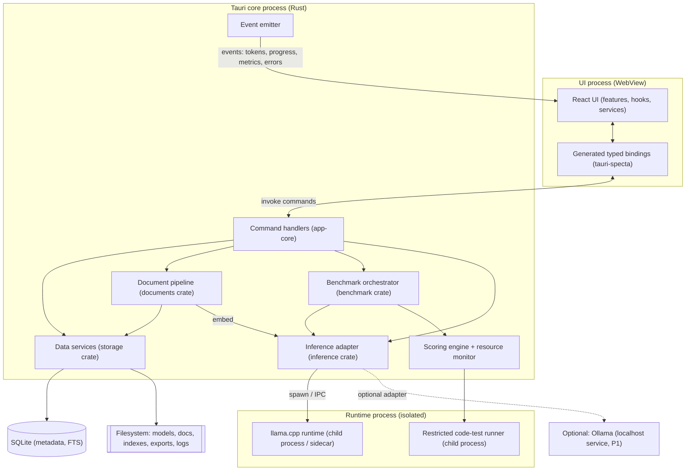
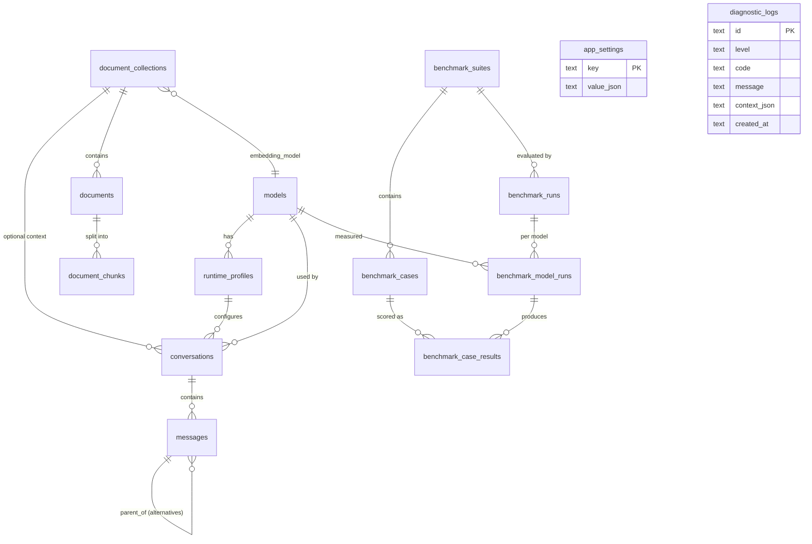

# PROJECT_REQUIREMENTS.md — Offline AI Assistant + Local Model Benchmarking System

> **Complete, implementation-ready development plan.** Primary source of truth: `OFFLINE_AI_ASSISTANT_SPEC.md` (Draft v1.0). This document expands that spec into an executable plan. Where the spec is silent or lists an open decision (spec §24), this document records an explicit assumption and flags it in §15. **No requirement from the spec is silently changed or dropped.**

| Field | Value |
| --- | --- |
| Status | Requirements v1.0 (planning phase — no code written) |
| Product type | Local-first desktop application |
| Primary platform (MVP) | **macOS on Apple Silicon** (resolved decision) |
| Follow-on platforms | Windows x64, Linux x64 (post-MVP; interfaces kept cross-platform) |
| UI stack | React 18 + TypeScript (strict), Vite, Tailwind CSS, shadcn/ui |
| Desktop shell | Tauri v2 |
| Default runtime | llama.cpp-compatible local runtime (out-of-process) |
| Optional runtime | Ollama adapter (P1) |
| Storage | SQLite (structured) + local filesystem (models, docs, indexes, exports) |
| Testing | Vitest (unit/component), Rust `cargo test`, Playwright (E2E) |

### Resolved product decisions (this planning session)

1. **Platform:** macOS Apple Silicon first; cross-platform interfaces preserved so Windows/Linux follow post-MVP.
2. **Model storage:** reference-in-place by default; "copy into app-managed storage" offered per import.
3. **Code benchmarks:** included in MVP via a **restricted child-process runner** (time/memory/fs/network limits).
4. **Overall score:** **presets** (Quality / Balanced / Speed); default **Balanced** = `0.60 Quality + 0.20 Speed + 0.10 Memory + 0.10 Stability`; weights always displayed; raw metrics never hidden.

### How to read this document

- **Requirement IDs are stable.** IDs already present in the spec (e.g. `FR-MOD-001`, `FR-CHAT-002`) are preserved verbatim. New requirements extend existing area prefixes.
- **Priorities:** `P0` = required for MVP; `P1` = shortly after MVP / if schedule allows; `P2` = future. (Spec §8.)
- **Cross-references:** requirement IDs are referenced by development phases (§13), Definition of Done (§16), and the task checklist (§17).

### Engineering rules (binding across all phases)

- Strict TypeScript; **no `any`** unless technically unavoidable and documented with a `// eslint-disable` justification.
- **Business logic lives outside React components** (feature modules, hooks call typed services; components render).
- **Feature-based** frontend modules; typed Tauri commands and events (generated bindings, §8).
- Inference engines sit **behind one adapter interface**; the runtime runs **outside the UI process**.
- **One loaded generation model at a time** (MVP).
- Secrets and private data are stored **only locally**. **No cloud APIs, no remote telemetry** anywhere.
- **Database migrations** for every schema change; benchmark progress persisted **after every measured case**.
- Prefer **deterministic** benchmark scorers; keep any LLM-judge score **visibly separate**.
- Keep the UI responsive during inference, indexing, and benchmarks.
- Every screen implements **empty, loading, warning, error, disabled, cancellation, and recovery** states.

---

## 1. Project Overview

### 1.1 What the product does

A desktop AI assistant that runs entirely on the user's computer and includes a reproducible benchmark workspace for comparing local models. After a model is installed, the app works with **no internet connection**. Users can:

- Chat with local GGUF models (streaming, stop, history, edit/regenerate, Markdown/code rendering).
- Attach local documents (PDF/TXT/Markdown/DOCX) and get retrieval-augmented answers with **source citations**.
- Import, inspect, load/unload, and configure local models with hardware-aware compatibility guidance.
- Create and run **fair, repeatable benchmark suites** across multiple models and read a plain-language recommendation covering quality, speed, memory, and stability.
- Export benchmark results as **JSON and CSV** with private paths redacted.

All prompts, documents, responses, benchmark results, and diagnostics remain on the device by default.

### 1.2 Problem it solves

Cloud AI assistants are unsuitable for private files, offline environments, and predictable-cost workflows. Local model tooling makes it hard for non-experts to know **which model is best on their hardware**. This product pairs a simple offline assistant with an understandable benchmark that answers two questions: (1) *Which local model works best on this computer?* (2) *Can I do everyday AI tasks without sending private data to the cloud?*

### 1.3 Target users (spec §6)

- **Developer** — code explanation/generation/debugging; compares coding-focused models.
- **Researcher / analyst** — confidential document Q&A and summarization; wants evidence of which model performs best on their material.
- **Student / general user** — a simple offline assistant plus a guided recommendation, without needing to understand quantization, context length, or GPU layers.

### 1.4 MVP goals

- Useful AI chat while fully offline; prompts/files/responses stay local.
- Hardware detection + compatible-model guidance.
- Multiple local models behind one inference interface (llama.cpp default).
- Fair, repeatable side-by-side benchmarks reporting quality, speed, memory, stability, efficiency in plain language.
- Reproducible benchmark configs and results; JSON/CSV export.

### 1.5 Non-goals for MVP (spec §4)

Training/fine-tuning; cloud-hosted inference; team collaboration/shared workspaces; mobile apps; autonomous computer control; plugin marketplace or arbitrary third-party code execution; real-time web search; enterprise device management.

### 1.6 Major assumptions (see §15 for full risk register)

- **A1 — Platform:** MVP ships macOS/Apple Silicon only; other OSes are post-MVP but no interface is macOS-specific.
- **A2 — Model source:** users supply their own GGUF files (local import); no model download catalog in MVP.
- **A3 — Ollama:** P1 adapter, not required for MVP.
- **A4 — Embedding model:** a small permissively-licensed embedding model (e.g. `bge-small-en-v1.5`, MIT, or `nomic-embed-text-v1.5`, Apache-2.0) is bundled or imported for RAG; final choice pending license sign-off (spec §24.3).
- **A5 — Built-in datasets:** small **original**, permissively-licensed suites are authored in-repo to avoid licensing/contamination risk (spec §22, §24.4).
- **A6 — Vector search:** brute-force cosine over persisted vectors (or `sqlite-vec`) is sufficient for MVP corpus sizes; ANN/HNSW is post-MVP.
- **A7 — Custom datasets:** JSONL import is P1 (spec §8).

### 1.7 Supported operating systems

| OS | MVP | Notes |
| --- | --- | --- |
| macOS 13+ (Apple Silicon, arm64) | ✅ P0 | First and only fully-supported MVP target; Metal backend. |
| Windows 11 x64 | ⏳ Post-MVP | Same UI/core; CUDA/Vulkan/CPU backends; packaged/selectable runtime binary. |
| Linux x64 (glibc) | ⏳ Post-MVP | Same UI/core; CUDA/Vulkan/CPU backends. |

---

## 2. Functional Requirements

Each requirement: **ID · Priority · Description · Dependencies · Acceptance criteria**. Requirement IDs are referenced by §13 (phases), §16 (DoD), and §17 (checklist).

### 2.1 First-Run Onboarding & Hardware Detection

#### FR-ONB-001 — Hardware scan · P0
- **Description:** On first run (and on demand), detect OS + architecture, CPU model + logical core count, total/available system memory, supported GPU/backend info when detectable, and available disk space. (Spec §9.1.)
- **Dependencies:** `system.inspect` command (§9); `HardwareInfo`/`RuntimeCapabilities` types (§8).
- **Acceptance criteria:** (a) Completes with **no network**; (b) UI shows every detected value and an explanation for any value that cannot be detected; (c) no raw hardware data leaves the device; (d) result cached and re-scannable.

#### FR-ONB-002 — Compatibility guidance · P0
- **Description:** Before loading a model, estimate memory requirements from model file size, chosen context length, runtime overhead, and available memory, and classify as **Recommended / May Be Slow / Not Recommended**. A user may override a *warning* but must never be allowed to select an *invalid* (guaranteed-OOM) configuration. (Spec §9.1.)
- **Dependencies:** FR-ONB-001; `models.estimateCompatibility` (§9); `CompatibilityAssessment` (§8).
- **Acceptance criteria:** (a) Estimate shown before load; (b) three classes rendered with plain-language reasons and **not by color alone**; (c) invalid configs are disabled with an explanation; (d) overriding a "May Be Slow" warning is allowed and logged.

#### FR-ONB-003 — First-run wizard · P0
- **Description:** Guided flow: welcome → hardware results → import first model (or skip) → confirm offline lock. Wizard is resumable and skippable; completion recorded in `app_settings`.
- **Dependencies:** FR-ONB-001, FR-MOD-001, FR-SET-003.
- **Acceptance criteria:** (a) Each step has empty/error states; (b) closing mid-wizard restores on next launch; (c) app is usable (with empty states) even if the user skips model import.

#### FR-SYS-001 — On-demand re-scan & runtime capability detection · P0
- **Description:** Re-run the hardware scan and detect runtime backends (Metal on macOS; CUDA/Vulkan/CPU elsewhere) and llama.cpp runtime version.
- **Dependencies:** FR-ONB-001; `system.inspect`.
- **Acceptance criteria:** (a) Re-scan updates cached capabilities; (b) backend + runtime version shown in Settings; (c) failure to detect a backend degrades gracefully to CPU with a notice.

### 2.2 Model Management

#### FR-MOD-001 — Import model · P0
- **Description:** Select a local GGUF file; validate it; read available metadata; compute **SHA-256**; then either store a **reference to the original path (default)** or **copy into app-managed storage** per user choice. (Spec §9.2.)
- **Dependencies:** `models.import` (§9); `ModelMetadata` (§8); `models` table (§7).
- **Acceptance criteria:** (a) Non-GGUF/corrupt files rejected with `MODEL_INVALID`; (b) checksum stored; (c) storage mode recorded per model; (d) duplicate import (same checksum) is detected and de-duplicated with a prompt.

#### FR-MOD-002 — Model library · P0
- **Description:** For each model display display-name, file name + location, parameter/architecture metadata when available, quantization, file size, checksum, compatibility status, and last-used date. (Spec §9.2.)
- **Dependencies:** FR-MOD-001; `models.list`.
- **Acceptance criteria:** (a) All listed fields render (with "unknown" fallbacks); (b) compatibility badge reflects current hardware; (c) empty state prompts import.

#### FR-MOD-003 — Runtime settings & profiles · P0
- **Description:** Advanced users configure context length, max generation tokens, temperature, top-p, top-k, repeat penalty, seed, thread count, batch size, and GPU offload layers (when supported); persisted as a **runtime profile**. Provide **Reset to Recommended**. (Spec §9.2.)
- **Dependencies:** FR-ONB-002; `models.updateRuntimeProfile`; `runtime_profiles` table; `RuntimeProfile` type.
- **Acceptance criteria:** (a) Each field validated against ranges + hardware; (b) Reset restores hardware-derived recommended values; (c) invalid combos blocked (ties to FR-ONB-002).

#### FR-MOD-004 — Model unload · P0
- **Description:** Unload the active model and release its memory without closing the app. (Spec §9.2.)
- **Dependencies:** `models.unload`; runtime process manager (§5).
- **Acceptance criteria:** (a) Memory released (verified via resource monitor); (b) subsequent generation requires an explicit load; (c) unload during generation cancels safely first.

#### FR-MOD-005 — Model load with preflight · P0
- **Description:** Load a selected model + runtime profile, running the compatibility preflight first; stream load progress and report `RUNTIME_CRASHED`/`MODEL_OOM` on failure.
- **Dependencies:** FR-ONB-002, FR-MOD-003; `models.load`.
- **Acceptance criteria:** (a) One model loaded at a time (loading a new one unloads the prior with confirmation); (b) load time recorded; (c) OOM produces `MODEL_OOM` with recovery guidance, not a crash.

#### FR-MOD-006 — Remove model · P0
- **Description:** Delete a model from the library; for **managed copies** delete the file, for **referenced** models delete only the reference. Confirmation states whether the source file will be affected. (Spec §9.6 deletion semantics.)
- **Dependencies:** FR-MOD-001; `models.remove`; `storage.deleteItem`.
- **Acceptance criteria:** (a) Referenced source files are never deleted; (b) dependent conversations/benchmark references are handled (blocked or cascade per §7); (c) confirmation is explicit and destructive-action styled.

### 2.3 Assistant Chat

#### FR-CHAT-001 — Conversation lifecycle · P0
- **Description:** Create, rename, search, and delete conversations. Each stores selected model, system prompt, generation config, messages, and optional document collection. (Spec §9.3.)
- **Dependencies:** `conversations.*`; `conversations`/`messages` tables.
- **Acceptance criteria:** (a) CRUD persists across restart; (b) deleting a conversation removes its messages transactionally; (c) empty state offers "New chat".

#### FR-CHAT-002 — Streaming generation · P0
- **Description:** Assistant responses appear incrementally; UI shows generation state, elapsed time, tokens generated, and a **Stop** action. (Spec §9.3.)
- **Dependencies:** `chat.generate` + `chat:token`/`chat:done`/`chat:error` events; `GenerationRequest`/`TokenEvent`/`GenerationResult`.
- **Acceptance criteria:** (a) Tokens render without freezing the UI; (b) live metrics (elapsed, token count, tok/s) update; (c) network stays untouched.

#### FR-CHAT-003 — Message actions · P0
- **Description:** Copy, edit-and-resend, retry/regenerate, and delete messages. **Regeneration retains the earlier response as an alternative** unless the user deletes it (message tree via `parent_id`). (Spec §9.3.)
- **Dependencies:** `messages.*`; `messages` table (`parent_id`).
- **Acceptance criteria:** (a) Alternatives are navigable; (b) edit-and-resend forks from the edited message; (c) deletion is transactional.

#### FR-CHAT-004 — Markdown & code rendering · P0
- **Description:** Render **sanitized** Markdown (tables, lists, fenced code with copy-code). Generated HTML/scripts must **never execute** in the UI. (Spec §9.3, §15.)
- **Dependencies:** sanitizer (§11); syntax highlighter.
- **Acceptance criteria:** (a) `<script>`/event handlers/`javascript:` URLs stripped; (b) code blocks have language label + copy button; (c) sanitization covered by security tests (§14).

#### FR-CHAT-005 — Context-window management · P0
- **Description:** Display estimated context usage; before the limit is exceeded, warn and offer to **summarize older messages locally** or start a new conversation. (Spec §9.3.)
- **Dependencies:** tokenizer via adapter; `CONTEXT_EXCEEDED` error.
- **Acceptance criteria:** (a) Usage meter shown; (b) warning appears before overflow; (c) local summarization uses the loaded model; (d) exceeding limit yields `CONTEXT_EXCEEDED` with recovery, never a silent truncation.

#### FR-CHAT-006 — Stop generation · P0
- **Description:** Stop is acknowledged within **500 ms** and terminates at the next safe runtime boundary; partial output is retained. (Spec §16.1.)
- **Dependencies:** `chat.cancel`; `AbortSignal` plumbing.
- **Acceptance criteria:** (a) Ack ≤500 ms; (b) partial text preserved and marked stopped; (c) a new request can start immediately after.

#### FR-CHAT-007 — Conversation search · P0
- **Description:** Search conversation titles/content; lists of **1,000 items remain searchable within 300 ms** locally. (Spec §16.1.)
- **Dependencies:** `conversations.search`; SQLite FTS index (§7).
- **Acceptance criteria:** (a) ≤300 ms at 1,000 conversations on the reference device; (b) empty/no-results states.

### 2.4 Local Document Q&A (RAG)

#### FR-RAG-001 — Supported files · P0
- **Description:** Ingest **PDF, TXT, Markdown, DOCX**. Scanned/OCR PDFs are P1. (Spec §9.4.)
- **Dependencies:** document parsers (§5.9); `documents.ingest`.
- **Acceptance criteria:** (a) Each type extracts text + source locators; (b) unsupported/unparseable files yield `DOCUMENT_PARSE_FAILED` with recovery; (c) OCR-only PDFs are detected and reported as unsupported in MVP.

#### FR-RAG-002 — Indexing · P0
- **Description:** Extract text, split into overlapping token-based chunks, generate embeddings **locally**, and persist the index on device. Indexing exposes **progress and cancellation**. (Spec §9.4, §14.)
- **Dependencies:** embedding model (A4); `documents.ingest` + `documents:progress`; `document_chunks` table + vector store.
- **Acceptance criteria:** (a) Progress events per document/chunk; (b) cancellation leaves a consistent partial state; (c) index persisted and reloadable; (d) checksum recorded per document.

#### FR-RAG-003 — Grounded answers with citations · P0
- **Description:** In document mode, responses include source references (filename, page/section when available, supporting excerpt). (Spec §9.4.)
- **Dependencies:** FR-RAG-005; `Citation`/`RetrievedChunk` types.
- **Acceptance criteria:** (a) Every grounded answer lists ≥1 citation mapping to a real chunk; (b) clicking a citation opens the source viewer at the locator; (c) "no relevant context found" is stated rather than hallucinated.

#### FR-RAG-004 — Collection management · P0
- **Description:** Create collections, add/remove files, rebuild an index, and delete a collection with its derived embeddings. (Spec §9.4.)
- **Dependencies:** `collections.*`, `documents.remove`, `documents.reindex`; `document_collections` table.
- **Acceptance criteria:** (a) Deleting a collection removes documents, chunks, and vectors transactionally; (b) rebuild re-embeds and reports progress; (c) empty state.

#### FR-RAG-005 — Retrieval · P0
- **Description:** For a question, retrieve top-k chunks (optional local rerank) and build a **bounded** prompt containing source identifiers. Default chunk/overlap/top-k stored with the collection. (Spec §14.)
- **Dependencies:** `documents.search`; vector store; `chunk_config_json`.
- **Acceptance criteria:** (a) Top-k configurable, defaulted, and persisted; (b) prompt stays within context budget; (c) retrieval settings reproducible from the collection record.

#### FR-RAG-006 — Source viewer · P0
- **Description:** Map cited identifiers back to a source viewer showing the excerpt in context. (Spec §14 step 9.)
- **Dependencies:** FR-RAG-003; `source_locator_json`.
- **Acceptance criteria:** (a) Citation → excerpt highlight; (b) page/section shown when available.

#### FR-RAG-007 — Reproducible collection/index config · P0
- **Description:** Persist chunk size, overlap, top-k, and the embedding model with each collection (`chunk_config_json`) so indexing and retrieval behavior is fully reproducible. (Spec §14.)
- **Dependencies:** FR-RAG-002, FR-RAG-005; `document_collections` table.
- **Acceptance criteria:** (a) Stored settings reproduce the same index + retrieval behavior; (b) settings are included in the collection record (and any export of it); (c) changing them requires an explicit reindex.

### 2.5 Benchmark Workspace

#### FR-BENCH-001 — Benchmark creation · P0
- **Description:** A run requires ≥1 installed model, a built-in or custom suite, a generation config, warm-up + measured repetition counts, and optional task-category weighting. (Spec §9.5.)
- **Dependencies:** `benchmarks.create`; `BenchmarkConfig`; suites (§10).
- **Acceptance criteria:** (a) Config validated + stored (**`warmupReps` must be ≥ 1**, §10.3); (b) estimated duration + disk shown; (c) invalid configs blocked with reasons.

#### FR-BENCH-002 — Fair execution · P0
- **Description:** Each compared model receives the **same** system prompt, test prompt, generation limit, sampling values, and seed **when the runtime supports them**; unsupported differences are recorded in the report. Prompt templates are byte-identical excluding required chat-template conversion. (Spec §9.5, §10.6.)
- **Dependencies:** FR-BENCH-001; adapter capability flags.
- **Acceptance criteria:** (a) Identical inputs verified per case; (b) any unsupported parameter is disclosed in the report; (c) no silent per-model divergence.

#### FR-BENCH-003 — Execution controls · P0
- **Description:** Start, **pause after the active case**, cancel, and rerun. Partial results preserved after cancellation or recoverable failure. (Spec §9.5.)
- **Dependencies:** `benchmarks.{start,pause,resume,cancel}`; orchestrator (§5.10).
- **Acceptance criteria:** (a) Pause takes effect at the next case boundary; (b) cancel preserves completed cases; (c) rerun creates a new run referencing the same config.

#### FR-BENCH-004 — Live progress · P0
- **Description:** Display active model, active case, completed/total cases, elapsed time, ETA, and current resource readings. (Spec §9.5.)
- **Dependencies:** `benchmark:progress` + `resource:reading` events; `BenchmarkProgressEvent`.
- **Acceptance criteria:** (a) Updates ≥1/s during a case without UI jank; (b) ETA derived from completed-case timings; (c) expandable per-case log.

#### FR-BENCH-005 — Results comparison · P0
- **Description:** Report compares overall weighted score, quality-by-category, TTFT, output tok/s, end-to-end latency, peak RAM/VRAM (where available), failure/timeout rate, and an energy-efficiency proxy where reliable power readings are unavailable. (Spec §9.5.)
- **Dependencies:** FR-SCORE-004..006; `BenchmarkResult`/`BenchmarkMetrics`.
- **Acceptance criteria:** (a) All listed metrics present or explicitly marked unavailable; (b) model colors consistent across charts; (c) raw measurements always accessible.

#### FR-BENCH-006 — Recommendation · P0
- **Description:** Identify best overall, best quality, fastest, most memory-efficient, and best-per-category model. Show scoring weights; never hide raw measurements. (Spec §9.5.)
- **Dependencies:** FR-SCORE-004; §10.5 rules.
- **Acceptance criteria:** (a) Each "best" is justified by cited numbers; (b) weights + preset shown; (c) explains that overall score is relative to the compared set.

#### FR-BENCH-007 — Reproducibility record · P0
- **Description:** Every run records app + benchmark-schema version, timestamp, OS/hardware snapshot, runtime engine + version, model name/path-safe id/size/checksum, complete generation settings, dataset name/version/checksum, warm-up + repetition config, and per-case input/output/score/timing/resource/error data. (Spec §9.5.)
- **Dependencies:** `benchmark_runs`/`benchmark_model_runs`/`benchmark_case_results` tables.
- **Acceptance criteria:** (a) A saved run contains every listed field; (b) a run can be reproduced from its record when checksums match; (c) mismatched checksums block silent reuse.

#### FR-BENCH-008 — Export · P0
- **Description:** Export a **CSV summary**, a **complete JSON** machine-readable report, and **individually selected** model responses. Exports exclude unrelated chats/documents and redact private paths. (Spec §9.5, §15.)
- **Dependencies:** `benchmarks.export`; export schemas (§10.12); redaction (§11).
- **Acceptance criteria:** (a) JSON validates against the published schema; (b) CSV opens cleanly; (c) redaction verified by tests; (d) unrelated data never included.

#### FR-BENCH-009 — Pause/resume & crash recovery · P0
- **Description:** On restart, interrupted runs are marked **Interrupted** and resumable from the next incomplete case when configuration and checksums still match. (Spec §16.2.)
- **Dependencies:** FR-BENCH-010; `benchmarks.resume`, `benchmarks.getProgress`.
- **Acceptance criteria:** (a) Interrupted state detected on launch; (b) resume continues from the correct case; (c) config/checksum mismatch forces a fresh run with explanation.

#### FR-BENCH-010 — Progress persistence · P0
- **Description:** Benchmark progress is persisted **after every measured case**. (Spec §16.1.)
- **Dependencies:** transactional writes (§7).
- **Acceptance criteria:** (a) Killing the app mid-run loses at most the in-flight case; (b) writes are transactional.

#### FR-BENCH-011 — Custom JSONL dataset import · P1
- **Description:** Import JSONL suites; validation reports the exact line and field for malformed entries. (Spec §10.2.)
- **Dependencies:** `datasets.validate`; `DATASET_INVALID` error.
- **Acceptance criteria:** (a) Malformed lines report line + field; (b) valid sets become selectable suites; (c) schema documented (§10.2).

#### FR-BENCH-012 — Built-in suites · P0
- **Description:** Ship reasoning, coding, summarization, extraction, instruction-following, and retrieval suites with local content + license metadata. (Spec §10.1.)
- **Dependencies:** `packages/benchmark-suites`; scorers (§10.4).
- **Acceptance criteria:** (a) All six categories present; (b) each case has an id/category/prompt/expected/scorer; (c) checksums recorded.

#### FR-BENCH-013 — Sequential measurement · P0
- **Description:** Run **one measured model at a time** in MVP to reduce resource contention; queue additional models. (Spec §10.6.)
- **Dependencies:** orchestrator.
- **Acceptance criteria:** (a) No two models measured concurrently; (b) queue order visible.

### 2.6 Scoring, Metrics & Resource Monitoring

#### FR-SCORE-001 — Deterministic scorers · P0
- **Description:** Provide exact/normalized match, JSON/schema validation, token-level precision/recall/F1, key-point/rubric matching, **citation recall** (fraction of gold source chunks cited), and **instruction-rule** checks (constraint/format adherence as a pass-rate). (Spec §10.4.)
- **Dependencies:** `benchmark/scorers`; `ScoreBreakdown`.
- **Acceptance criteria:** (a) Each scorer is pure + unit-tested; (b) output normalized to 0–100; (c) scorer id recorded per case.

#### FR-SCORE-002 — Restricted code-test execution · P0
- **Description:** Run coding-suite unit tests in an **isolated child process** with strict time, memory, filesystem, and **network** limits; never execute code in the UI or privileged process. (Spec §10.4, §15.)
- **Dependencies:** sandbox runner (§5.11, §11).
- **Acceptance criteria:** (a) No network access from the sandbox; (b) time/memory limits enforced and kill-safe; (c) fs access restricted to a scratch dir; (d) `BENCH_CASE_TIMEOUT` on overrun.

#### FR-SCORE-003 — Optional local LLM-as-judge · P1
- **Description:** Optional judge scoring, **clearly labeled subjective**, recording judge model + prompt; a model does not judge its own output by default; judge scores are kept **separate** from deterministic scores. (Spec §10.4.)
- **Dependencies:** loaded judge model; `BenchmarkResult` (separate fields).
- **Acceptance criteria:** (a) Judge on/off toggle; (b) judge outputs never averaged into deterministic scores; (c) judge model + prompt shown in the report.

#### FR-SCORE-004 — Overall weighted score & presets · P0
- **Description:** Overall = weighted sum of Quality/Speed/Memory-Efficiency/Stability normalized within the compared set; presets Quality/Balanced/Speed, default Balanced (`0.60/0.20/0.10/0.10`). If a metric is unavailable, redistribute its weight proportionally and disclose. (Spec §10.5.)
- **Dependencies:** FR-SCORE-005/006.
- **Acceptance criteria:** (a) Formula + active preset displayed; (b) missing-metric redistribution shown; (c) overall labeled relative-to-run; raw quality independently comparable.

#### FR-SCORE-005 — Performance measurement · P0
- **Description:** Measure load time, TTFT, generation speed (tok/s), and end-to-end latency; for repeated cases report median + p95 latency and mean + std-dev generation speed; exclude warm-ups. (Spec §10.3.)
- **Dependencies:** high-resolution timers in the runtime process.
- **Acceptance criteria:** (a) Definitions match §10.3 exactly; (b) warm-ups excluded from aggregates; (c) per-case timing stored.

#### FR-SCORE-006 — Resource monitoring · P0
- **Description:** Sample CPU, RAM, GPU/VRAM, and thermal readings where supported; attribute peak RAM/VRAM per case; record background load at run start; warn when memory/battery/thermal may distort results. (Spec §10.6, §12.)
- **Dependencies:** `resource:reading` event; `ResourceReading` type.
- **Acceptance criteria:** (a) Peak RAM/VRAM per case captured (or marked unavailable); (b) distortion warnings surfaced; (c) sampling does not materially perturb measurements.

### 2.7 Settings, Storage & Diagnostics

#### FR-SET-001 — Storage visibility · P0
- **Description:** Show where models, chats, indexes, and benchmark reports are stored and how much disk each category uses. (Spec §9.6.)
- **Dependencies:** `storage.usage`.
- **Acceptance criteria:** (a) Per-category sizes + paths; (b) refreshes on demand.

#### FR-SET-002 — Deletion · P0
- **Description:** Delete an individual item or all local application data; destructive actions require confirmation and state whether imported **source** model files are affected. (Spec §9.6.)
- **Dependencies:** `storage.deleteItem`, `storage.deleteAll`.
- **Acceptance criteria:** (a) Confirmation required; (b) referenced source files never deleted; (c) deletion transactional and verifiable (index files removed, §16 DoD).

#### FR-SET-003 — Offline lock · P0
- **Description:** A setting that prevents all application-initiated network access, **enabled by default** for MVP; localhost UI↔runtime communication remains allowed. (Spec §9.6.)
- **Dependencies:** network policy (§11); Tauri allowlist/CSP.
- **Acceptance criteria:** (a) On by default; (b) no external request occurs in offline-mode tests (§14); (c) loopback runtime still functions.

#### FR-SET-004 — Appearance & accessibility settings · P0
- **Description:** Neutral dark/light themes; reduced-motion; readable status indicators. (Spec §11.3, §16.3.)
- **Dependencies:** design system (§13 Phase 2).
- **Acceptance criteria:** (a) Theme persists; (b) reduced-motion respected; (c) WCAG AA contrast for core UI.

#### FR-SET-005 — Runtime binary management · P1
- **Description:** Select/manage architecture-specific runtime binaries. (Spec §16.4.)
- **Dependencies:** FR-SYS-001.
- **Acceptance criteria:** (a) Correct binary auto-selected per arch; (b) manual override available.

#### FR-DIAG-001 — Local diagnostic logging · P0
- **Description:** Record runtime start/stop/crash, model-load duration + memory outcome, generation timing + cancellation, indexing progress + parser errors, and benchmark lifecycle + scorer errors — **locally**, excluding secrets/prompt/document content by default. (Spec §17, §18.)
- **Dependencies:** `diagnostic_logs` table.
- **Acceptance criteria:** (a) Events logged with stable codes; (b) no prompt/doc content unless explicitly opted in; (c) size-bounded with rotation.

#### FR-DIAG-002 — View / export / clear diagnostics · P0
- **Description:** Users view, export, and clear diagnostic logs; export clearly states whether prompt/output content is included (default excluded). (Spec §18.)
- **Dependencies:** `diagnostics.{list,export,clear}`.
- **Acceptance criteria:** (a) Export redacts by default; (b) clear is confirmed; (c) content-inclusion is an explicit opt-in.

### 2.8 Non-Functional Requirements (summary; targets in §12)

- **NFR-PERF-001** App shell interactive ≤3 s (excl. model load) · P0
- **NFR-PERF-002** UI responsive during inference/indexing/benchmarks · P0
- **NFR-PERF-003** Stop acknowledged ≤500 ms · P0
- **NFR-PERF-004** Benchmark progress persisted per measured case · P0
- **NFR-PERF-005** Conversation search ≤300 ms at 1,000 items · P0
- **NFR-REL-001** Runtime crash does not crash the UI · P0
- **NFR-REL-002** Interrupted benchmark runs resumable · P0
- **NFR-REL-003** Message + benchmark writes transactional · P0
- **NFR-REL-004** Invalid model/dataset never corrupts existing data · P0
- **NFR-A11Y-001..005** Keyboard nav, visible focus, semantic labels, WCAG AA contrast, reduced motion · P0
- **NFR-COMPAT-001** macOS Apple Silicon first · P0; **-002** Win/Linux x64 follow · P1; **-003** arch-specific runtime binaries · P0/P1
- **NFR-SEC-001..0nn** Offline/network-block, CSP, sanitization, path-traversal prevention, sandbox, redaction (enumerated in §11) · P0

---

## 3. User Flows

Each flow lists the happy path plus the key alternate/error branches. Steps reference commands (§9) and requirements (§2).

### 3.1 First application launch
1. App starts offline; splash → onboarding wizard (FR-ONB-003).
2. Hardware scan runs automatically (`system.inspect`, FR-ONB-001); results shown with per-value explanations.
3. Offline lock is presented as **on by default** (FR-SET-003); user confirms.
4. User is invited to import a model now or later.
5. Wizard completion recorded in `app_settings`; user lands on Chat (empty state).
- **Alt/errors:** scan value undetectable → shown as "Unknown" with reason; user skips import → Chat shows "No model loaded" empty state.

### 3.2 Hardware detection
1. From Settings → "Re-scan hardware" (FR-SYS-001).
2. `system.inspect` returns `HardwareInfo` + `RuntimeCapabilities`.
3. UI updates CPU/RAM/GPU-backend/disk + runtime version.
- **Errors:** backend undetectable → CPU fallback notice; disk read failure → per-field error, others still shown.

### 3.3 Importing a local model
1. Models screen → **Import** → OS file picker (GGUF).
2. `models.import` validates, reads metadata, computes SHA-256.
3. User chooses **reference in place (default)** or **copy to managed storage** (FR-MOD-001).
4. Compatibility computed (FR-ONB-002) and badge shown.
- **Errors:** non-GGUF/corrupt → `MODEL_INVALID`, pick another; duplicate checksum → de-dup prompt; low disk on copy → `DISK_SPACE_LOW`.

### 3.4 Starting a conversation
1. Chat → **New chat** (FR-CHAT-001); pick model + optional system prompt + optional collection.
2. If model not loaded, preflight + load (FR-MOD-005); OOM → `MODEL_OOM` recovery.
3. Compose a prompt; send.
- **Alt:** incompatible model selected → "Not Recommended" gate (FR-ONB-002).

### 3.5 Streaming and stopping a response
1. Send prompt → `chat.generate`; tokens stream via `chat:token` (FR-CHAT-002); live metrics update.
2. User clicks **Stop** → `chat.cancel`; ack ≤500 ms (FR-CHAT-006); partial text retained + marked stopped.
3. `chat:done` finalizes metrics; user can immediately send again.
- **Errors:** context exceeded → `CONTEXT_EXCEEDED` with summarize/new-chat options (FR-CHAT-005); runtime crash → `RUNTIME_CRASHED`, UI survives (NFR-REL-001).

### 3.6 Uploading and indexing documents
1. Documents → create/select collection (FR-RAG-004) → add files (PDF/TXT/MD/DOCX).
2. `documents.ingest` extracts, chunks, embeds locally; `documents:progress` drives a progress bar (FR-RAG-002).
3. User may **cancel**; partial state stays consistent.
- **Errors:** parse failure → `DOCUMENT_PARSE_FAILED` per file; scanned PDF → unsupported-in-MVP notice.

### 3.7 Asking questions using document context
1. In a document-mode conversation, ask a question.
2. `documents.search` retrieves top-k chunks (FR-RAG-005); bounded prompt built with source ids.
3. Answer streams with **citations** (FR-RAG-003); clicking a citation opens the source viewer (FR-RAG-006).
- **Alt:** no relevant chunks → "No supporting context found" (no hallucinated citation).

### 3.8 Creating a benchmark
1. Benchmarks → **New** (FR-BENCH-001): select models, suite (§10), generation config, warm-up + measured reps, optional category weights + score preset (FR-SCORE-004).
2. Estimated duration + disk shown; `benchmarks.create` validates + stores config.
- **Errors:** no model/suite selected → blocked with reason; custom dataset invalid → `DATASET_INVALID` (line+field, P1).

### 3.9 Comparing multiple models
1. From a saved config → **Start** (`benchmarks.start`, FR-BENCH-003).
2. Orchestrator runs **one model at a time** (FR-BENCH-013): load → warm-up → measured reps per case; identical inputs (FR-BENCH-002).
3. Live progress + resource readings stream (FR-BENCH-004); progress persisted per case (FR-BENCH-010).
4. **Pause-after-case** / **Cancel** available; partial results preserved.

### 3.10 Viewing and exporting benchmark results
1. On completion → Benchmark Report (FR-BENCH-005/006): recommendation, comparison table, quality-by-category, speed-vs-quality, resource comparison, failed cases.
2. **Export** (FR-BENCH-008): CSV summary / full JSON / selected responses; paths redacted (§11).
- **Errors:** disk low → `DISK_SPACE_LOW`.

### 3.11 Recovering an interrupted benchmark
1. App restarts after a crash/quit mid-run.
2. Run detected as **Interrupted** (FR-BENCH-009); checksums re-verified.
3. Match → **Resume from next incomplete case** (`benchmarks.resume`); mismatch → offer fresh run with explanation.

### 3.12 Deleting local data
1. Settings → Storage (FR-SET-001): per-category sizes + paths.
2. Delete an item or **all data** (FR-SET-002); confirmation states whether **source** model files are affected.
3. Deletion is transactional; derived indexes removed (verified, §16 DoD).

---

## 4. Application Screens

For each screen: **purpose · layout · major components · states · actions**. Global states convention: **loading / success / empty / warning / disabled / error** (+ cancellation/recovery where relevant). Primary nav (spec §11.1): **Chat · Documents · Benchmarks · Models · Settings**.

### 4.1 Onboarding
- **Purpose:** first-run setup (FR-ONB-003).
- **Layout:** centered stepper (Welcome → Hardware → Model → Offline lock).
- **Components:** `HardwareSummaryCard`, `ModelImportButton`, `OfflineLockToggle`, stepper nav.
- **States:** loading (scan running); success (scan complete); empty (no model imported — allowed); warning (undetectable values); error (scan failure per-field); disabled (Next until step valid).
- **Actions:** run/re-run scan, import model, toggle offline lock, skip, finish.

### 4.2 Chat
- **Purpose:** core assistant (FR-CHAT-*).
- **Layout:** left conversation sidebar · center message timeline · bottom composer · right/top live-performance summary.
- **Components:** `ModelSelector` (with compatibility badge), `MessageList`, `MessageBubble` (Markdown/code, copy, edit, retry, alternatives), `Composer` (file/collection selector), `GenerationControls` (Stop, live metrics), `ContextUsageMeter`.
- **States:** empty (no messages / no model → CTA to load); loading (streaming); success (completed); warning (context near limit); error (`RUNTIME_CRASHED`, `MODEL_OOM`, `CONTEXT_EXCEEDED`); disabled (send disabled with no model); cancellation (Stop → partial retained); recovery (reload model after crash).
- **Actions:** new/rename/search/delete chat, select model + collection, send, stop, edit/retry/copy/delete message, navigate alternatives.

### 4.3 Conversation sidebar
- **Purpose:** browse/search conversations (FR-CHAT-001/007).
- **Layout:** search box + virtualized list + "New chat".
- **Components:** `ConversationSearch`, `ConversationListItem`, context menu.
- **States:** empty ("No conversations"); loading; no-results; error.
- **Actions:** search, open, rename, delete, new.

### 4.4 Models
- **Purpose:** manage installed models (FR-MOD-*).
- **Layout:** grid of model cards + Import action + detail drawer.
- **Components:** `ModelCard` (name, quant, size, checksum, compatibility, last used), `ImportDialog`, `RuntimeSettingsForm` (context/tokens/temp/top-p/top-k/repeat/seed/threads/batch/gpu-layers + Reset to Recommended), `CompatibilityBadge`.
- **States:** empty (import CTA); loading (import/checksum); success; warning (May Be Slow); disabled (Not Recommended load blocked); error (`MODEL_INVALID`, `DISK_SPACE_LOW`).
- **Actions:** import, load, unload, edit runtime profile, reset, remove.

### 4.5 Model import
- **Purpose:** validate + register a GGUF (FR-MOD-001).
- **Layout:** dialog: file path → metadata preview → storage choice (reference/copy) → confirm.
- **Components:** file picker, `MetadataPreview`, `StorageModeChoice`, checksum progress.
- **States:** loading (validating/checksumming); success; warning (duplicate checksum); error (`MODEL_INVALID`).
- **Actions:** choose file, pick storage mode, confirm/cancel.

### 4.6 Documents
- **Purpose:** ingest + manage files for RAG (FR-RAG-*).
- **Layout:** collection selector · document list · add-files drop zone · index status.
- **Components:** `CollectionSelector`, `DocumentListItem` (status, page count), `IngestProgress`, `SourceViewer`.
- **States:** empty (no collection/docs); loading (indexing with progress); success (indexed); warning (large file); error (`DOCUMENT_PARSE_FAILED`); cancellation (partial index consistent).
- **Actions:** create/select collection, add/remove files, reindex, cancel, open source viewer, delete collection.

### 4.7 Document collections
- **Purpose:** manage collections + reproducible index config (FR-RAG-004/007).
- **Layout:** list of collections with counts, sizes, embedding model, chunk config.
- **Components:** `CollectionCard`, `ChunkConfigForm`, delete confirmation.
- **States:** empty; loading; success; error.
- **Actions:** create, edit chunk config, rebuild, delete (cascade embeddings).

### 4.8 Benchmark setup
- **Purpose:** configure a run (FR-BENCH-001).
- **Layout:** model multi-select · suite selector (categories + case counts) · basic/advanced settings · score preset · estimated duration/disk · Start.
- **Components:** `ModelMultiSelect`, `SuiteSelector`, `GenerationConfigForm`, `RepetitionConfig` (warm-up/measured), `CategoryWeighting`, `ScorePresetSelector`, `EstimateBanner`.
- **States:** empty (nothing selected); disabled (Start until valid); warning (thermal/battery/memory caution); error (`DATASET_INVALID`).
- **Actions:** select models/suite, edit config, choose preset, estimate, start.

### 4.9 Benchmark execution
- **Purpose:** monitor a running benchmark (FR-BENCH-003/004).
- **Layout:** progress header (active model/case, completed/total, elapsed, ETA) · live metrics (TTFT, tok/s, RAM, VRAM) · expandable case log · Pause/Cancel.
- **Components:** `RunProgressHeader`, `LiveMetrics`, `ResourceGauges`, `CaseLog`, `PauseCancelControls`.
- **States:** loading (loading model/warm-up); success (case complete); warning (resource caution); error (case failure/timeout logged, run continues); cancellation (partial preserved); recovery (Interrupted → resume).
- **Actions:** pause-after-case, cancel, expand case, view partial results.

### 4.10 Benchmark report
- **Purpose:** compare + recommend + export (FR-BENCH-005/006/008).
- **Layout:** recommendation summary · overall comparison table · quality-by-category chart · speed-vs-quality chart · resource comparison · failed-case inspection · Rerun/Export.
- **Components:** `RecommendationSummary` (with weights + preset), `ComparisonTable`, `QualityByCategoryChart`, `SpeedQualityChart`, `ResourceComparison`, `FailedCaseList`, `ExportMenu`.
- **States:** loading; success; empty (no completed cases); warning (metric unavailable → weight redistribution disclosed); error (export failure).
- **Actions:** inspect case, toggle preset (re-derives overall), rerun, export CSV/JSON/selected responses.

### 4.11 Settings
- **Purpose:** app-wide config (FR-SET-*, FR-DIAG-*).
- **Layout:** sections — General (theme, reduced motion), Privacy (offline lock), Runtime (binary, version), Diagnostics.
- **Components:** `ThemeToggle`, `OfflineLockToggle`, `RuntimeInfo`, `DiagnosticsPanel`.
- **States:** success; warning (offline lock off → prominent warning); error.
- **Actions:** change theme, toggle offline lock, re-scan hardware, view/export/clear diagnostics.

### 4.12 Storage management
- **Purpose:** visibility + deletion (FR-SET-001/002).
- **Layout:** per-category usage table (models, chats, indexes, reports) with paths + sizes; delete controls.
- **Components:** `StorageUsageTable`, `DeleteItemButton`, `DeleteAllButton` (confirmation stating source-file impact).
- **States:** loading (computing sizes); success; warning (low disk); error.
- **Actions:** refresh, delete item, delete all.

### 4.13 Error & empty states (global)
- **Purpose:** consistent, actionable failure/empty UX.
- **Components:** `ErrorBoundary` (per feature route), `EmptyState`, `ErrorState` (code + message + recovery action from §17 error table), `OfflineBadge`.
- **States:** covers every `AppError` code with a suggested recovery; empty states for every list; a global runtime-crash banner (recovery: restart runtime, FR-DIAG-001).
- **Actions:** retry, reconfigure, open diagnostics, dismiss.

---

## 5. Technical Architecture

### 5.1 High-level architecture



### 5.2 Component responsibilities (spec §12.1)

| Component | Responsibility |
| --- | --- |
| React UI | Screens, local UI state, streaming display, charts, accessibility |
| Tauri core | Secure desktop APIs, typed commands/events, filesystem access, process lifecycle |
| Inference adapter | Common `load / generate / cancel / tokenize / embed / unload / capabilities` interface (spec §12.2) |
| llama.cpp runtime | Default GGUF inference + embeddings, in an isolated child process |
| Ollama adapter (P1) | Optional connection to a locally installed Ollama service (loopback) |
| Data services | SQLite repositories, migrations, file metadata, retrieval, exports |
| Document pipeline | Parse → normalize → chunk → embed → persist → retrieve |
| Benchmark orchestrator | Run queue, warm-ups, repetitions, pause/cancel, recovery, per-case persistence |
| Scoring engine | Deterministic scorers, restricted test runner, optional local judge |
| Resource monitor | CPU/RAM/GPU/VRAM/thermal sampling where supported |

### 5.3 Frontend architecture

- **Feature-based modules** under `apps/desktop/src/features/{chat,models,documents,benchmarks,onboarding,settings}` — each with `components/`, `hooks/`, `services/` (typed wrappers over generated bindings), and `state/`.
- **State management:** TanStack Query for command/query state + optimistic updates; Zustand for ephemeral UI/session state (active generation, streaming buffers). **No business logic in components** — components consume hooks; hooks call typed services.
- **Streaming:** a `useStreamingGeneration` hook subscribes to `chat:token`/`chat:done`/`chat:error` and appends to a buffer store; rendering is virtualized to keep the UI responsive (NFR-PERF-002).
- **Routing:** React Router with a route-level `ErrorBoundary` per feature (§5.15).
- **Styling:** Tailwind + shadcn/ui; a theme provider for dark/light; a shared component library in `packages/ui`.

### 5.4 Tauri / native application layer

- **Tauri v2** with a minimal capability set: filesystem scoped to app data + user-chosen model/doc paths (via dialogs), dialog, shell (only to spawn the runtime sidecar), and no HTTP capability when offline lock is on.
- Commands are thin: validate input → call a crate service → return typed result or `AppError`. Long-running commands emit progress events and accept a cancellation token.
- **Process lifecycle** owned by the core: runtime + sandbox children are spawned, health-checked, and reaped by a `RuntimeSupervisor`.

### 5.5 Local inference runtime

- Default runtime is **out-of-process** (child process / Tauri sidecar) so a runtime crash cannot take down the UI (NFR-REL-001). Communication via stdio/local IPC (length-prefixed JSON) or a loopback-bound HTTP server with a random per-session token (spec §15).
- **One generation model loaded at a time** (MVP). Loading a new model unloads the current one (with confirmation).
- Embeddings run in a **dedicated embedding-model instance** (not the generation runtime), so a document query can embed and generate without unload/reload churn. The **one-loaded-model-at-a-time** rule applies to **generation** models only; the small embedding model may stay resident alongside the loaded generation model.

### 5.6 Inference adapter interface (spec §12.2 — authoritative)

```ts
interface InferenceAdapter {
  inspectModel(source: string): Promise<ModelMetadata>;
  loadModel(config: LoadModelConfig): Promise<LoadedModel>;
  generate(
    request: GenerationRequest,
    onToken: (event: TokenEvent) => void,
    signal: AbortSignal
  ): Promise<GenerationResult>;
  embed(texts: string[], config: EmbeddingConfig): Promise<number[][]>;
  tokenize(text: string): Promise<number[]>;
  unloadModel(modelId: string): Promise<void>;
  capabilities(): Promise<RuntimeCapabilities>;
}
```

- Adapter-specific differences are **normalized** into common result types; raw runtime metadata is preserved for diagnostics (spec §12.2). Adapters declare capability flags (supports seed? gpu offload? deterministic sampling?) consumed by benchmark fairness (FR-BENCH-002).
- The **adapter contract** is exercised by a shared contract-test suite (§14) so every engine behaves identically from the UI's perspective.

### 5.7 llama.cpp integration

- Bundle/select an architecture-specific `llama.cpp` server/CLI binary (Metal build for Apple Silicon MVP). Version + build flags recorded for reproducibility (FR-BENCH-007).
- The Rust `inference` crate wraps the binary: spawn, warm-up, generate with streaming, tokenize, embed, unload, and report load time + memory outcome (FR-MOD-005, FR-SCORE-005).

### 5.8 Optional Ollama integration (P1)

- An `OllamaAdapter` implements `InferenceAdapter` against a **locally installed** Ollama service on loopback. Capability flags mark unsupported parameters (e.g. fixed seed) which are then disclosed in benchmark reports (FR-BENCH-002). Disabled unless the user opts in; still subject to offline lock (localhost only).

### 5.9 Document processing pipeline (spec §14)

```mermaid
flowchart LR
    A["Validate type + checksum"] --> B["Extract text + source locators"]
    B --> C["Normalize whitespace (keep page/section boundaries)"]
    C --> D["Token-based chunking + overlap"]
    D --> E["Local embeddings"]
    E --> F["Persist vectors + metadata"]
    F --> G["Query: retrieve top-k (+ optional rerank)"]
    G --> H["Bounded prompt with source ids"]
    H --> I["Generate answer → map citations to source viewer"]
```



- Parsers: PDF (text layer), TXT, Markdown, DOCX. Scanned/OCR PDFs are detected and deferred to P1. Defaults (chunk size, overlap, top-k) are stored with the collection (`chunk_config_json`) for reproducibility (FR-RAG-007).

### 5.10 Benchmark orchestration

```mermaid
sequenceDiagram
    participant UI
    participant Orchestrator
    participant Adapter
    participant Runtime
    participant Store as SQLite
    UI->>Orchestrator: benchmarks.start(runId)
    loop for each model (sequential, FR-BENCH-013)
        Orchestrator->>Adapter: loadModel(profile)
        Adapter->>Runtime: spawn/load
        Orchestrator->>Runtime: warm-up case(s)
        loop for each case × measured reps
            Orchestrator->>Runtime: generate (identical inputs)
            Runtime-->>Orchestrator: output + timing
            Orchestrator->>Orchestrator: score (deterministic; optional judge)
            Orchestrator->>Store: persist case result (transactional)
            Orchestrator-->>UI: benchmark:progress / resource:reading
        end
        Orchestrator->>Adapter: unloadModel
    end
    Orchestrator-->>UI: benchmark:done (aggregate)
```

- Supports **pause-after-case**, **cancel** (partial preserved), and **resume** from the next incomplete case after a crash when config + checksums match (FR-BENCH-009). Progress persisted after **every** measured case (FR-BENCH-010).

### 5.11 Scoring engine

- Deterministic scorers (exact/normalized, JSON/schema, token P/R/F1, key-point/rubric) run in-process (pure functions). **Code tests** run in the restricted sandbox (§5.12). Optional **local judge** runs via the adapter and is stored separately. Overall score computed per §10.5 with preset weights.

### 5.12 Resource monitoring

- A sampler thread reads process/system CPU + RAM, and GPU/VRAM + thermal where the platform exposes them (Metal/`ioreg`/`powermetrics` on macOS with graceful degradation). Emits `resource:reading`; attributes peak RAM/VRAM per case (FR-SCORE-006). Sampling cadence is bounded to avoid perturbing measurements.

### 5.13 Event-based streaming between Tauri and React

- Core → UI via Tauri events: `chat:token`, `chat:done`, `chat:error`, `documents:progress`, `benchmark:progress`, `benchmark:case-complete`, `benchmark:done`, `benchmark:error`, `resource:reading`, `runtime:crashed`. Payload types are generated (§8). Each streaming command carries a correlation id so the UI can route events to the right view.

### 5.14 Runtime process isolation

- Runtime + sandbox children run with least privilege: **no network enforced by a per-process OS sandbox** (macOS Seatbelt / `sandbox-exec` profile denying `network*` — **not** the app-level offline lock, which cannot constrain a child process's own sockets), restricted fs (scratch dir), enforced CPU-time + wall-time + memory `rlimit`s, and are killed + restarted by the supervisor on crash. A crash emits `runtime:crashed` and surfaces a recovery banner without crashing the UI (NFR-REL-001).

### 5.15 Error boundaries and recovery

- **Frontend:** per-route React `ErrorBoundary` renders `ErrorState` from the §17 error table and offers recovery (retry/reconfigure/open diagnostics).
- **Core:** every command returns `Result<T, AppError>`; errors carry a stable code (§8, §17) and are logged locally (FR-DIAG-001).
- **Recovery flows:** runtime crash → supervisor restart; interrupted benchmark → resume (FR-BENCH-009); destructive migration → DB backup first (§7.4).

---

## 6. Project Structure

Monorepo (spec §25), pnpm + Cargo workspaces. Each directory's responsibility:

```text
offline-ai-assistant/
├── apps/
│   └── desktop/                     # React UI + Tauri app
│       ├── src/
│       │   ├── app/                 # app shell, routing, providers, error boundaries
│       │   ├── features/            # feature modules (business logic in hooks/services)
│       │   │   ├── onboarding/      # components/ hooks/ services/ state/
│       │   │   ├── chat/
│       │   │   ├── models/
│       │   │   ├── documents/
│       │   │   ├── benchmarks/
│       │   │   └── settings/
│       │   ├── lib/                 # bindings.ts (generated), event router, formatters
│       │   ├── styles/              # Tailwind config + globals
│       │   └── test/                # Vitest setup, test utils
│       ├── src-tauri/               # Rust binary crate = Tauri host
│       │   ├── src/                 # command registration, event wiring, supervisor
│       │   ├── capabilities/        # Tauri v2 capability/permission files
│       │   ├── binaries/            # arch-specific runtime sidecars (gitignored/large)
│       │   └── tauri.conf.json      # CSP, allowlist, bundle config
│       ├── e2e/                     # Playwright specs + fixtures
│       └── index.html / vite.config.ts
├── crates/
│   ├── app-core/                    # command handlers, orchestration, AppError, event emit
│   ├── inference/                   # InferenceAdapter trait, LlamaAdapter, (OllamaAdapter P1), supervisor
│   ├── benchmark/                   # orchestrator, metrics, scorers/, sandbox runner
│   ├── documents/                   # parsers, chunking, embeddings, retrieval
│   └── storage/                     # SQLite repositories, migrations/, models, FTS
├── packages/
│   ├── ui/                          # shared React components (shadcn-based)
│   ├── contracts/                   # TS types (generated from Rust) + hand-written UI-only types
│   └── benchmark-suites/            # versioned built-in datasets + license metadata + checksums
├── fixtures/                        # tiny test model(s), sample documents, sample datasets
├── docs/                            # architecture, ADRs, contributor + security guides
├── scripts/                         # packaging, checksum, type-gen, offline-check, release
├── .github/ or ci/                  # CI pipelines (lint, test, type-drift, e2e, package)
├── Cargo.toml / pnpm-workspace.yaml / package.json
```

**Directory responsibilities (summary):**
- `apps/desktop/src/features/*` — one folder per feature; **all business logic in `hooks/` + `services/`**, components render only.
- `apps/desktop/src-tauri` — the privileged host: registers typed commands, emits events, owns the `RuntimeSupervisor`, enforces CSP/capabilities.
- `crates/*` — pure Rust logic, independently unit-tested; no Tauri types leak into domain crates (app-core adapts).
- `packages/contracts` — the single TS view of shared types, **generated** from Rust (§8); UI-only types are hand-written and clearly separated.
- `packages/benchmark-suites` — versioned datasets; each suite ships `version`, `source`, `license`, and a `checksum` (FR-BENCH-007/012).
- `scripts/` — includes `generate-bindings`, `verify-offline` (network-block test harness), `checksum-suites`, and packaging scripts.

---

## 7. Database Design

SQLite with foreign keys **on** (`PRAGMA foreign_keys = ON`), WAL mode, and transactional deletes. Large binaries (models, vectors, index blobs) live on the **filesystem**; SQLite holds metadata + references (spec §13.2). Two tables the user's outline requires but spec §13.1 omits — **`app_settings`** and **`diagnostic_logs`** — are added here, plus a **`schema_migrations`** bookkeeping table.

### 7.1 Entity–relationship diagram



### 7.2 Table definitions

Conventions: `id` = TEXT UUID (opaque, spec §13.2); timestamps = TEXT ISO-8601 UTC; `*_json` = validated JSON text; deletion behavior noted per FK.

| Table | Key columns | Foreign keys → on delete | Notes / indexes |
| --- | --- | --- | --- |
| `models` | id PK, name, file_uri, storage_mode('reference'\|'managed'), sha256 UNIQUE, size_bytes, format, architecture, quantization, metadata_json, last_used_at, created_at | — | `sha256` UNIQUE (de-dup, FR-MOD-001); index on `last_used_at` |
| `runtime_profiles` | id PK, model_id, engine, context_length, threads, gpu_layers, batch_size, generation_defaults_json, is_default, created_at | model_id → models **CASCADE** | one `is_default` per model |
| `conversations` | id PK, title, model_id, runtime_profile_id, collection_id, system_prompt, created_at, updated_at | model_id → models **SET NULL**; runtime_profile_id → runtime_profiles **SET NULL**; collection_id → document_collections **SET NULL** | FTS index on title (+ message content) for search ≤300 ms (FR-CHAT-007) |
| `messages` | id PK, conversation_id, parent_id, role('system'\|'user'\|'assistant'), content, status('complete'\|'streaming'\|'stopped'\|'error'), metrics_json, created_at | conversation_id → conversations **CASCADE**; parent_id → messages **CASCADE** | `parent_id` enables regenerate alternatives (FR-CHAT-003); index (conversation_id, created_at) |
| `document_collections` | id PK, name, embedding_model_id, chunk_config_json, created_at | embedding_model_id → models **RESTRICT** | chunk/overlap/top-k defaults stored here (FR-RAG-007) |
| `documents` | id PK, collection_id, source_uri, sha256, mime_type, page_count, status('indexed'\|'pending'\|'error'), metadata_json, created_at | collection_id → document_collections **CASCADE** | index on (collection_id, sha256) |
| `document_chunks` | id PK, document_id, ordinal, text, source_locator_json, embedding_ref | document_id → documents **CASCADE** | `embedding_ref` → filesystem/`sqlite-vec` `vec0` vector (vec0 rows deleted via trigger/repo, §7.3); index (document_id, ordinal) |
| `benchmark_suites` | id PK, name, version, source, license, checksum, config_json, created_at | — | (name, version) UNIQUE; checksum (FR-BENCH-007) |
| `benchmark_cases` | id PK, suite_id, external_id, category, prompt, system_prompt, expected_json, scorer, config_json | suite_id → benchmark_suites **CASCADE** | index (suite_id, category) |
| `benchmark_runs` | id PK, suite_id, status('created'\|'running'\|'paused'\|'completed'\|'cancelled'\|'interrupted'), config_json, hardware_json, app_version, schema_version, started_at, completed_at | suite_id → benchmark_suites **RESTRICT** | status drives recovery (FR-BENCH-009) |
| `benchmark_model_runs` | id PK, run_id, model_id, model_name, model_sha256, runtime_profile_json, aggregate_json, status | run_id → benchmark_runs **CASCADE**; model_id → models **SET NULL** | one row per compared model; `model_name`/`model_sha256` retained for reproducibility after a model is removed |
| `benchmark_case_results` | id PK, model_run_id, case_id, repetition, is_warmup, output, score_json, timing_json, resource_json, error_json, created_at | model_run_id → benchmark_model_runs **CASCADE**; case_id → benchmark_cases **RESTRICT** | persisted per case (FR-BENCH-010); index (model_run_id, case_id, repetition) |
| `app_settings` **(added)** | key PK, value_json, updated_at | — | offline lock, theme, onboarding-complete, score preset (FR-SET-*, FR-ONB-003) |
| `diagnostic_logs` **(added)** | id PK, level, code, message, context_json, created_at | — | content excluded by default (FR-DIAG-001); size-bounded/rotated; index on created_at |
| `schema_migrations` **(added)** | version PK, name, applied_at, checksum | — | migration bookkeeping (§7.4) |

### 7.3 Deletion behavior (summary)

- Delete **conversation** → cascades messages (FR-CHAT-001). Delete **collection** → cascades documents → chunks → vectors; conversations referencing it are `SET NULL` (become non-document-mode) (FR-RAG-004). Delete **model** → managed file removed / reference left; `benchmark_model_runs.model_id` is `SET NULL` (historical runs keep `model_name`/`model_sha256` for reproducibility) while the **app layer blocks deleting a model whose benchmark is currently running** (FR-MOD-006); conversations `SET NULL`. A model serving as a collection's **embedding model** is `RESTRICT` (re-point or delete the collection first). Delete **benchmark run** → cascades model-runs → case-results. Vector/index data is removed in the same transaction: filesystem index files via compensating cleanup, and — on the `sqlite-vec` path — `vec0` virtual-table rows via an `AFTER DELETE ON document_chunks` trigger or repository-level deletion inside the same transaction (FK `CASCADE` does **not** reach virtual tables), so "delete a collection removes its index" (§16 DoD) holds.

### 7.4 Migration strategy

- **Forward-only, versioned** SQL migrations in `crates/storage/migrations/NNNN_name.sql`, tracked in `schema_migrations` with a checksum; applied in a transaction at startup.
- **Backup before destructive migration:** copy the DB file before any migration that drops/rewrites data (spec §13.2).
- **Schema versions are independent** of app version and benchmark-schema/export version (spec §26); each recorded in exports (FR-BENCH-007).
- **Tested:** migration up-tests on fixture DBs, plus a "migrate an old DB to head" test (§14). Invalid model/dataset imports never mutate schema (NFR-REL-004).

---

## 8. TypeScript and Rust Contracts

**Single source of truth = Rust.** Types are defined in Rust with `serde` + `specta`; `tauri-specta` generates typed command/event bindings into `apps/desktop/src/lib/bindings.ts` (re-exported by `packages/contracts`). A CI check (`scripts/generate-bindings` + `git diff --exit-code`) fails the build if bindings drift from Rust. Strict TS consumes these; **no `any`**.

> The TS shown below is the *generated shape* (illustrative). Rust structs carry `#[derive(Serialize, Deserialize, specta::Type)]`. Enums map to TS discriminated unions.

### 8.1 Model & hardware

```ts
type StorageMode = "reference" | "managed";

interface ModelMetadata {           // spec §12.2
  format: "gguf";
  architecture: string | null;
  parameterCount: number | null;
  quantization: string | null;
  contextLengthMax: number | null;
  sizeBytes: number;
  sha256: string;
  raw: Record<string, string>;      // preserved runtime metadata (diagnostics)
}

interface HardwareInfo {
  os: string; arch: string;
  cpuModel: string | null; logicalCores: number | null;
  totalMemoryBytes: number | null; availableMemoryBytes: number | null;
  gpus: Array<{ name: string; backend: "metal" | "cuda" | "vulkan" | "cpu"; vramBytes: number | null }>;
  availableDiskBytes: number | null;
  undetected: string[];             // fields that could not be read (FR-ONB-001)
}

interface RuntimeCapabilities {     // spec §12.2
  engine: "llama.cpp" | "ollama";
  engineVersion: string;
  supportsSeed: boolean; supportsGpuOffload: boolean;
  supportsEmbeddings: boolean; deterministicSampling: boolean;
  maxContext: number | null;
}

interface CompatibilityAssessment {
  status: "recommended" | "may_be_slow" | "not_recommended";
  estimatedMemoryBytes: number; availableMemoryBytes: number;
  reasons: string[]; blocking: boolean;   // blocking=true → load disabled (FR-ONB-002)
}

interface RuntimeProfile {              // per-model runtime binding (chat uses the full profile)
  id: string; modelId: string; engine: RuntimeCapabilities["engine"];
  contextLength: number; maxTokens: number;
  temperature: number; topP: number; topK: number; repeatPenalty: number;
  seed: number | null; threads: number; batchSize: number; gpuLayers: number;
}

interface ModelRow {                    // library row (FR-MOD-002); returned by models.list
  id: string; name: string; fileUri: string; storageMode: StorageMode;
  sizeBytes: number; sha256: string;
  architecture: string | null; quantization: string | null;
  lastUsedAt: string | null;
  compatibility: CompatibilityAssessment | null;   // vs current hardware (FR-MOD-002)
}
```

### 8.2 Loading & generation

```ts
interface LoadModelConfig {          // spec §12.2
  modelId: string; profile: RuntimeProfile;
}
interface LoadedModel {              // spec §12.2
  modelId: string; loadTimeMs: number; capabilities: RuntimeCapabilities;
}
interface EmbeddingConfig { modelId: string; normalize: boolean; }

interface GenerationRequest {        // spec §12.2
  correlationId: string;
  modelId: string;
  messages: Array<{ role: "system" | "user" | "assistant"; content: string }>;
  profile: RuntimeProfile;
  stop?: string[];
}
interface TokenEvent {               // spec §12.2
  correlationId: string; token: string; index: number;
}
interface GenerationResult {         // spec §12.2
  correlationId: string;
  text: string;
  finishReason: "stop" | "length" | "cancelled" | "error";
  timing: { ttftMs: number; totalMs: number; outputTokens: number; tokensPerSecond: number };
  raw: Record<string, unknown>;
}
```

### 8.3 Documents

```ts
interface DocumentMetadata {
  id: string; collectionId: string; sourceUri: string; sha256: string;
  mimeType: "application/pdf" | "text/plain" | "text/markdown" |
            "application/vnd.openxmlformats-officedocument.wordprocessingml.document";
  pageCount: number | null; status: "pending" | "indexed" | "error";
}
interface RetrievedChunk {
  chunkId: string; documentId: string; text: string; score: number;
  locator: { page?: number; section?: string; charStart: number; charEnd: number };
}
interface Citation {
  chunkId: string; documentId: string; fileName: string;
  page?: number; section?: string; excerpt: string;
}
```

### 8.4 Benchmark

```ts
type ScorePreset = "quality" | "balanced" | "speed";
type ScorerId = "exact_match" | "normalized_match" | "json_fields" |
                "schema_valid" | "token_f1" | "keypoint" | "unit_tests" |
                "citation_recall" | "instruction_rules" | "llm_judge";

interface GenerationParams {            // shared across ALL compared models for fairness (FR-BENCH-002)
  maxTokens: number; temperature: number; topP: number; topK: number;
  repeatPenalty: number; seed: number | null;
}
interface BenchmarkConfig {
  suiteId: string; modelIds: string[];
  generation: GenerationParams;                     // identical for every model (fairness; overrides per-profile sampling)
  profilesByModel: Record<string, RuntimeProfile>;  // per-model runtime binding (context/threads/batch/gpuLayers)
  warmupReps: number;                               // must be >= 1 (validated by benchmarks.create, §10.3)
  measuredReps: number;
  categoryWeights?: Record<string, number>;
  scorePreset: ScorePreset;
  timeoutMsPerCase: number;
  enableJudge: boolean; judgeModelId?: string;
}
interface BenchmarkProgressEvent {
  runId: string; modelId: string; caseId: string;
  completedCases: number; totalCases: number;
  elapsedMs: number; etaMs: number | null; phase: "loading" | "warmup" | "measuring";
}
interface ResourceReading {
  runId?: string; cpuPercent: number | null; ramBytes: number | null;
  vramBytes: number | null; thermalState: string | null; at: string;
}
interface BenchmarkMetrics {           // per model, aggregated
  qualityByCategory: Record<string, number>;   // 0–100 deterministic
  ttftMsMedian: number; ttftMsP95: number;
  tokensPerSecondMean: number; tokensPerSecondStdDev: number;
  latencyMsMedian: number; latencyMsP95: number;
  peakRamBytes: number | null; peakVramBytes: number | null;
  failureRate: number; timeoutRate: number;
  energyProxy: number | null;
}
interface ScoreBreakdown {
  overall: number; quality: number; speed: number; memory: number; stability: number;
  weights: { quality: number; speed: number; memory: number; stability: number };
  redistributedForUnavailable: string[];
  judgeSeparate?: { scoreByCategory: Record<string, number>; judgeModelId: string; judgePrompt: string };
}
interface BenchmarkCaseResultExport {   // full per-case record for the "complete" JSON export (FR-BENCH-007)
  caseId: string; repetition: number; isWarmup: boolean;
  input: string; output: string;
  score: Record<string, unknown>; timing: Record<string, unknown>;
  resource: Record<string, unknown>; error: AppError | null;
}
interface BenchmarkResult {
  runId: string; schemaVersion: string; appVersion: string; createdAt: string;
  hardware: HardwareInfo; runtime: RuntimeCapabilities;
  config: { warmupReps: number; measuredReps: number; scorePreset: ScorePreset; generation: GenerationParams };
  perModel: Array<{
    modelId: string; modelName: string; modelSha256: string;
    pathSafeId: string; sizeBytes: number; profile: RuntimeProfile;
    metrics: BenchmarkMetrics; score: ScoreBreakdown;
    unsupportedParams: string[];       // disclosed (FR-BENCH-002)
    caseResults: BenchmarkCaseResultExport[];   // per-case reproducibility record (FR-BENCH-007)
  }>;
  recommendation: {
    bestOverall: string; bestQuality: string; fastest: string;
    mostMemoryEfficient: string; bestByCategory: Record<string, string>;
  };
  dataset: { name: string; version: string; checksum: string };
}
```

### 8.5 Errors

```ts
type AppErrorCode =
  | "MODEL_INVALID" | "MODEL_OOM" | "RUNTIME_CRASHED" | "CONTEXT_EXCEEDED"
  | "DOCUMENT_PARSE_FAILED" | "BENCH_CASE_TIMEOUT" | "DATASET_INVALID"
  | "DISK_SPACE_LOW" | "INTERNAL";
interface AppError {                   // spec §17
  code: AppErrorCode; message: string; recovery: string;
  details?: Record<string, unknown>;   // redacted before export
}
interface ExportBundle {
  kind: "benchmark_json" | "benchmark_csv" | "responses" | "diagnostics";
  schemaVersion: string; redacted: boolean; includesContent: boolean;
}
```

### 8.6 Keeping TS and Rust in sync

- Rust structs/enums are the source; `specta` derives schemas; `tauri-specta` emits typed `commands`/`events` wrappers into `bindings.ts`.
- `scripts/generate-bindings` runs in CI; a drift check (`git diff --exit-code bindings.ts`) fails if a dev forgot to regenerate.
- Serde `rename_all = "camelCase"` keeps field names idiomatic on both sides. Enums with data map to TS discriminated unions.
- Export/JSON **schema versions** are versioned separately and validated by tests (§14).

---

## 9. Local Command and Event API

All UI↔core communication uses **typed Tauri commands** (no public network API). Every command returns `Result<Response, AppError>`. Streaming/long-running commands accept a `correlationId` and emit events. Errors below reference §17 codes.

### 9.1 System inspection

| Command | Purpose | Request | Response | Errors | Events |
| --- | --- | --- | --- | --- | --- |
| `system.inspect` | Hardware + runtime capabilities (FR-ONB-001, FR-SYS-001) | `{}` | `{ hardware: HardwareInfo, capabilities: RuntimeCapabilities }` | `INTERNAL` | — |

### 9.2 Models

| Command | Purpose | Request | Response | Errors | Events |
| --- | --- | --- | --- | --- | --- |
| `models.import` | Validate + register GGUF (FR-MOD-001) | `{ sourcePath, storageMode }` | `{ model: ModelMetadata & { id } }` | `MODEL_INVALID`, `DISK_SPACE_LOW` | `documents:progress`-style checksum progress (optional) |
| `models.list` | Library (FR-MOD-002) | `{}` | `{ models: Array<ModelRow> }` | `INTERNAL` | — |
| `models.estimateCompatibility` | Preflight (FR-ONB-002) | `{ modelId, profile }` | `CompatibilityAssessment` | `INTERNAL` | — |
| `models.load` | Load model + profile (FR-MOD-005) | `LoadModelConfig` | `LoadedModel` | `MODEL_OOM`, `RUNTIME_CRASHED`, `MODEL_INVALID` | `runtime:crashed` |
| `models.unload` | Release memory (FR-MOD-004) | `{ modelId }` | `{ ok: true }` | `RUNTIME_CRASHED` | — |
| `models.updateRuntimeProfile` | Save profile (FR-MOD-003) | `{ profile: RuntimeProfile }` | `{ profile }` | `INTERNAL` | — |
| `models.remove` | Delete model (FR-MOD-006) | `{ modelId }` | `{ ok: true, sourceFileAffected: boolean }` | `INTERNAL` | — |

### 9.3 Chat & conversations

| Command | Purpose | Request | Response | Errors | Events |
| --- | --- | --- | --- | --- | --- |
| `chat.generate` | Stream response (FR-CHAT-002) | `GenerationRequest` | `GenerationResult` | `CONTEXT_EXCEEDED`, `RUNTIME_CRASHED`, `MODEL_OOM` | `chat:token`, `chat:done`, `chat:error` |
| `chat.cancel` | Stop generation (FR-CHAT-006) | `{ correlationId }` | `{ ok: true }` | `INTERNAL` | `chat:done` (finishReason=cancelled) |
| `conversations.create` | New conversation (FR-CHAT-001) | `{ title?, modelId?, profileId?, collectionId?, systemPrompt? }` | `{ conversation }` | `INTERNAL` | — |
| `conversations.list` | List | `{}` | `{ conversations }` | `INTERNAL` | — |
| `conversations.rename` | Rename | `{ id, title }` | `{ ok: true }` | `INTERNAL` | — |
| `conversations.delete` | Delete (cascade messages) | `{ id }` | `{ ok: true }` | `INTERNAL` | — |
| `conversations.search` | Search ≤300 ms (FR-CHAT-007) | `{ query, limit }` | `{ results }` | `INTERNAL` | — |
| `messages.edit` | Edit + fork (FR-CHAT-003) | `{ messageId, content }` | `{ message }` | `INTERNAL` | — |
| `messages.regenerate` | Retry, keep alternative | `{ messageId }` | `GenerationResult` | as `chat.generate` | `chat:token`… |
| `messages.delete` | Delete message/subtree | `{ messageId }` | `{ ok: true }` | `INTERNAL` | — |

### 9.4 Documents

| Command | Purpose | Request | Response | Errors | Events |
| --- | --- | --- | --- | --- | --- |
| `collections.create` | New collection (FR-RAG-004) | `{ name, embeddingModelId, chunkConfig }` | `{ collection }` | `INTERNAL` | — |
| `collections.list` | List | `{}` | `{ collections }` | `INTERNAL` | — |
| `collections.delete` | Delete + cascade vectors | `{ id }` | `{ ok: true }` | `INTERNAL` | — |
| `documents.ingest` | Extract/chunk/embed/index (FR-RAG-002) | `{ collectionId, sourcePaths }` | `{ documents: DocumentMetadata[] }` | `DOCUMENT_PARSE_FAILED`, `DISK_SPACE_LOW` | `documents:progress` |
| `documents.search` | Retrieve top-k (FR-RAG-005) | `{ collectionId, query, topK }` | `{ chunks: RetrievedChunk[] }` | `INTERNAL` | — |
| `documents.remove` | Remove a document | `{ documentId }` | `{ ok: true }` | `INTERNAL` | — |
| `documents.reindex` | Rebuild index (FR-RAG-004) | `{ collectionId }` | `{ ok: true }` | `DISK_SPACE_LOW` | `documents:progress` |

### 9.5 Benchmarks

| Command | Purpose | Request | Response | Errors | Events |
| --- | --- | --- | --- | --- | --- |
| `suites.list` | Built-in + custom suites (FR-BENCH-012) | `{}` | `{ suites }` | `INTERNAL` | — |
| `datasets.validate` | JSONL validation (FR-BENCH-011, P1) | `{ path }` | `{ ok, errors?: Array<{ line, field, message }> }` | `DATASET_INVALID` | — |
| `benchmarks.create` | Validate + store config (FR-BENCH-001) | `BenchmarkConfig` | `{ runId }` | `DATASET_INVALID`, `DISK_SPACE_LOW` | — |
| `benchmarks.start` | Execute (FR-BENCH-003) | `{ runId }` | `{ ok: true }` | `RUNTIME_CRASHED`, `MODEL_OOM` | `benchmark:progress`, `benchmark:case-complete`, `resource:reading`, `benchmark:done`, `benchmark:error` |
| `benchmarks.pause` | Pause after case (FR-BENCH-003) | `{ runId }` | `{ ok: true }` | `INTERNAL` | `benchmark:progress` |
| `benchmarks.resume` | Resume from next case (FR-BENCH-009) | `{ runId }` | `{ ok: true }` | `RUNTIME_CRASHED` | `benchmark:progress`… |
| `benchmarks.cancel` | Cancel, preserve partial (FR-BENCH-003) | `{ runId }` | `{ ok: true }` | `INTERNAL` | `benchmark:done` (cancelled) |
| `benchmarks.getProgress` | Current progress/state (FR-BENCH-009) | `{ runId }` | `{ status, progress }` | `INTERNAL` | — |
| `benchmarks.export` | JSON/CSV/responses (FR-BENCH-008) | `{ runId, kind, redact }` | `ExportBundle & { path }` | `DISK_SPACE_LOW` | — |

### 9.6 Settings, storage & diagnostics

| Command | Purpose | Request | Response | Errors | Events |
| --- | --- | --- | --- | --- | --- |
| `settings.get` | Read settings (FR-SET-*) | `{ key? }` | `{ settings }` | `INTERNAL` | — |
| `settings.set` | Write setting (offline lock, theme, preset) | `{ key, value }` | `{ ok: true }` | `INTERNAL` | — |
| `storage.usage` | Per-category sizes + paths (FR-SET-001) | `{}` | `{ categories: Array<{ name, path, bytes }> }` | `INTERNAL` | — |
| `storage.deleteItem` | Delete one item (FR-SET-002) | `{ kind, id }` | `{ ok: true, sourceFileAffected }` | `INTERNAL` | — |
| `storage.deleteAll` | Delete all local data (FR-SET-002) | `{ confirm: true }` | `{ ok: true }` | `INTERNAL` | — |
| `diagnostics.list` | View logs (FR-DIAG-002) | `{ limit, since? }` | `{ logs }` | `INTERNAL` | — |
| `diagnostics.export` | Export logs (redacted default) | `{ includeContent: boolean }` | `ExportBundle & { path }` | `DISK_SPACE_LOW` | — |
| `diagnostics.clear` | Clear logs | `{ confirm: true }` | `{ ok: true }` | `INTERNAL` | — |

### 9.7 Events (payload types in §8)

| Event | Emitted by | Payload | Consumed for |
| --- | --- | --- | --- |
| `chat:token` | `chat.generate` | `TokenEvent` | streaming render (FR-CHAT-002) |
| `chat:done` | `chat.generate/cancel` | `GenerationResult` | finalize metrics |
| `chat:error` | `chat.generate` | `AppError` | error state |
| `documents:progress` | `documents.ingest/reindex` | `{ collectionId, done, total, phase }` | indexing progress (FR-RAG-002) |
| `benchmark:progress` | orchestrator | `BenchmarkProgressEvent` | live progress (FR-BENCH-004) |
| `benchmark:case-complete` | orchestrator | `{ runId, caseId, modelId, result }` | case log + persistence signal |
| `benchmark:done` | orchestrator | `BenchmarkResult` | report |
| `benchmark:error` | orchestrator | `AppError` | error state (run continues per case) |
| `resource:reading` | resource monitor | `ResourceReading` | live gauges (FR-SCORE-006) |
| `runtime:crashed` | supervisor | `{ engine, code }` | recovery banner (NFR-REL-001) |

---

## 10. Benchmarking Methodology

### 10.1 Built-in benchmark categories (spec §10.1)

| Suite | Example tasks | Default quality method | Scorer id |
| --- | --- | --- | --- |
| General reasoning | Constraint problems, ordering, classification | Exact / normalized rule-based match | `exact_match` / `normalized_match` |
| Coding | Function completion, bug identification, output prediction | Unit tests in a restricted runner | `unit_tests` |
| Summarization | Short factual documents | Key-point coverage (+ optional local judge) | `keypoint` (+ `llm_judge`) |
| Extraction | JSON fields from supplied text | Schema validation + field-level F1 | `json_fields` / `schema_valid` |
| Instruction following | Formatting & constraint adherence | Deterministic rule checks | `instruction_rules` |
| Retrieval | Questions over a bundled document set | Answer match + citation recall | `token_f1` + `citation_recall` |

Built-in datasets contain **no sensitive data**, ship **source/license metadata**, and are **original** where feasible (mitigates contamination + licensing, spec §22; assumption A5).

### 10.2 Dataset format & validation (spec §10.2)

Custom suites (P1, FR-BENCH-011) import **JSONL**, one case per line:

```json
{
  "id": "extract-001",
  "category": "extraction",
  "prompt": "Extract the order ID and total as JSON...",
  "system_prompt": "Return valid JSON only.",
  "expected": { "order_id": "A-1007", "total": 299.5 },
  "scorer": "json_fields",
  "timeout_ms": 60000,
  "tags": ["structured-output"]
}
```

- **Validation** (`datasets.validate`) reports the **exact line and field** for malformed entries and fails with `DATASET_INVALID`. Required fields: `id`, `category`, `prompt`, `expected`, `scorer`. `scorer` must be a known `ScorerId`. Duplicate `id`s are rejected. A dataset checksum is computed on import (FR-BENCH-007).

### 10.3 Execution model: warm-up & measured repetitions

- After loading each model, run **≥1 warm-up case** (spec §10.6); warm-ups are recorded with `is_warmup=true` and **excluded from aggregates** (FR-SCORE-005). `benchmarks.create` **rejects `warmupReps < 1`**.
- Run `measuredReps` measured repetitions per case; persist each result immediately (FR-BENCH-010).
- **One measured model at a time** (FR-BENCH-013); record background system load at run start (FR-SCORE-006).

### 10.4 Fair model comparison rules (spec §10.6)

- Identical system prompt, test prompt, generation limit, sampling values, and **seed** across models **when supported**; unsupported parameters are listed in `unsupportedParams` and shown in the report (FR-BENCH-002).
- Prompt templates are **byte-identical** except for required per-model chat-template conversion.
- Timeouts and malformed outputs are **recorded, not silently retried** (spec §10.6). Do not compare runs across different hardware as equivalent.

### 10.5 Measurement definitions (spec §10.3)

| Metric | Definition | Unit |
| --- | --- | --- |
| Load time | Model load start → runtime-ready | ms |
| Time to first token (TTFT) | Request accepted → first generated token | ms |
| Generation speed | Output tokens ÷ generation time | tokens/s |
| End-to-end latency | Request accepted → completion/error | ms |
| Peak RAM | Max process/system memory attributed during a case | MiB |
| Peak VRAM | Max detected accelerator memory during a case | MiB |
| Quality | Scorer output normalized to 0–100 | score |
| Stability | Successful measured cases ÷ attempted cases (= 100 − failure rate) | percent |
| Failure rate | Failed measured cases ÷ attempted (a timeout counts as a failure) | percent |
| Timeout rate | Timed-out measured cases ÷ attempted | percent |
| Energy proxy | Where reliable power is unreadable: relative energy per 1k output tokens = `(normalized peak RAM + total CPU-time) ÷ output tokens × 1000`; comparison-relative only; `null` when inputs are unavailable | index (relative) |

For repeated cases: report **median + p95** latency and **mean + std-dev** generation speed. Warm-ups excluded. Invariant: **Stability = 100 − failure rate**.

### 10.6 Quality scoring hierarchy (spec §10.4)

Prefer deterministic evaluation, in order: (1) exact/normalized match → (2) JSON/schema validation → (3) **unit tests in an isolated process** with strict limits → (4) token precision/recall/F1 → (5) key-point/rubric → (6) **optional local LLM-as-judge, labeled subjective**.

- Every scorer normalizes to **0–100**; the scorer id is stored per case. `citation_recall` = (distinct gold source chunks cited ÷ total gold source chunks) × 100. `instruction_rules` = (satisfied constraints ÷ total constraints) × 100. Both are deterministic and unit-tested (FR-SCORE-001).
- **Deterministic vs judge separation (hard rule):** judge scores are stored in `ScoreBreakdown.judgeSeparate` and are **never** averaged into the deterministic Quality component or the overall score. The report renders them in a clearly-labeled separate panel with the judge model + prompt.

### 10.7 Restricted code-test execution (spec §10.4 #3, §15)

- Coding-suite tests run in an **isolated child process** (never in the UI or privileged process) under a **per-process OS sandbox** (macOS Seatbelt / `sandbox-exec` profile) enforcing: **no network** (deny `network*` — the OS sandbox, not the app offline lock), filesystem restricted to a per-case scratch dir, and **CPU-time + wall-time + memory `rlimit`s**. Overrun → `BENCH_CASE_TIMEOUT` (recorded, not retried). A security test (§14.9) asserts the runner cannot open an outbound socket.
- The runner returns pass/fail per test + captured output; the scorer maps to 0–100. See §11 for the sandbox threat model.

### 10.8 Optional local LLM-as-judge (spec §10.4)

- Off by default. When enabled, a chosen judge model scores subjective suites; a model **does not judge its own output by default**. The judge model id + exact prompt are recorded and shown. Judge output is subjective and visually separated (see §10.6).

### 10.9 Overall weighted score (spec §10.5)

```text
Overall = w_q × Quality + w_s × Speed + w_m × MemoryEfficiency + w_t × Stability
Balanced (default): w_q=0.60, w_s=0.20, w_m=0.10, w_t=0.10
Quality preset:     w_q=0.80, w_s=0.10, w_m=0.05, w_t=0.05
Speed preset:       w_q=0.40, w_s=0.35, w_m=0.15, w_t=0.10
```

- Each component is normalized to **0–100 within the compared models + hardware context**; the UI states the overall score is **relative to that run**, while raw Quality metrics remain independently comparable.
- **Component derivation (deterministic), each min-max normalized to 0–100 within the compared set** (best model → 100, worst → 0; if all equal, all → 100):
  - **Quality** = mean of the deterministic per-category quality scores (already 0–100), then normalized.
  - **Speed** = median output tok/s (primary signal), normalized so the highest tok/s → 100; TTFT may be blended in as a secondary term.
  - **Memory Efficiency** = inverse of peak RAM (+ peak VRAM where present, summed as bytes), normalized so the **lowest** footprint → 100.
  - **Stability** = `100 − failureRate` (already 0–100; not re-normalized).
- **Single-model runs:** min-max normalization is undefined for one model, so components are reported as **raw** values and Overall is shown as *"n/a — needs ≥2 models"*; all raw metrics remain valid.
- If a required metric is unavailable, its weight is **redistributed proportionally** among the remaining components and the change is **disclosed** (`redistributedForUnavailable`).
- Presets are user-selectable (resolved decision 4); toggling a preset re-derives the overall score in the report without re-running (weights are display+derivation only; raw metrics unchanged).

### 10.10 Recommendation rules (spec §9.5 FR-BENCH-006)

- **Best overall** = highest Overall under the active preset. **Best quality** = highest deterministic Quality (preset-independent). **Fastest** = **lowest median end-to-end latency** (primary); ties broken by **highest median output tok/s**. **Most memory-efficient** = lowest peak RAM (+VRAM where present). **Best per category** = highest category Quality.
- Each recommendation cites the raw numbers behind it; weights + preset are shown; raw measurements are never hidden.

### 10.11 Reproducibility & checksums (spec §9.5 FR-BENCH-007, §15)

- Each run records app + benchmark-schema version, timestamp, OS/hardware snapshot, runtime engine + version, per-model name/path-safe id/size/**SHA-256**, complete generation settings, dataset name/version/**checksum**, warm-up/repetition config, and per-case input/output/score/timing/resource/error.
- **Checksums are verified** before reusing a cached index or resuming a run (spec §15); mismatch blocks silent reuse and forces a fresh run with an explanation (FR-BENCH-009).

### 10.12 Result export schemas (spec §9.5 FR-BENCH-008)

- **JSON:** the full `BenchmarkResult` (§8.4) plus `schemaVersion`; validated against a published JSON Schema in tests (§14). Deterministic and judge scores are separate fields.
- **CSV summary:** one row per model with columns `model, overall, quality, ttft_ms_median, tokens_per_second_mean, latency_ms_median, peak_ram_mib, peak_vram_mib, failure_rate, timeout_rate, preset`.
- **Responses export:** only **explicitly selected** model responses.
- **All exports** redact absolute paths/usernames/unrelated hardware ids (§11), exclude unrelated chats/documents, and flag `includesContent`.

---

## 11. Security and Privacy

**Guiding invariant (spec §5.2):** no prompt, document, response, benchmark result, or telemetry leaves the device. The following controls are each an `NFR-SEC-*` requirement (P0 unless noted).

| ID | Control | Implementation |
| --- | --- | --- |
| NFR-SEC-001 | **Offline-only behavior** | App fully functional with network blocked; verified by offline E2E (§14). |
| NFR-SEC-002 | **Network blocking** | Offline lock on by default (FR-SET-003); Tauri HTTP capability withheld; no telemetry/crash-upload/update-check/remote fonts (spec §15). |
| NFR-SEC-003 | **Localhost restriction** | Any local runtime HTTP binds **loopback only**; connections to a separate local service (Ollama) use a **random per-session token** (spec §15). |
| NFR-SEC-004 | **Content Security Policy** | Restrictive CSP in `tauri.conf.json`: `default-src 'self'`; no remote origins; no inline scripts; `connect-src` limited to the loopback runtime port. |
| NFR-SEC-005 | **Markdown sanitization** | Sanitize rendered Markdown; strip `<script>`, event handlers, `javascript:`/`data:` URLs; generated content cannot invoke desktop commands (spec §15, FR-CHAT-004). |
| NFR-SEC-006 | **File validation** | Validate type + magic bytes for GGUF and documents; compute checksums; reject unknown/oversized inputs. |
| NFR-SEC-007 | **Path-traversal prevention** | Canonicalize + confine all fs access to app-data + user-chosen roots; reject `..`/symlink escapes; commands never accept arbitrary absolute paths outside granted scope. |
| NFR-SEC-008 | **Prompt-injection consideration** | Treat document text + model output as **untrusted**; RAG prompts wrap retrieved content with clear delimiters and instructions not to follow embedded commands; citations reference source, not execute it. |
| NFR-SEC-009 | **Secure command permissions** | Minimal Tauri v2 capabilities per window; no `shell` beyond spawning the runtime sidecar; least-privilege fs scopes. |
| NFR-SEC-010 | **Runtime process isolation** | Runtime + sandbox are separate child processes; a crash cannot compromise or crash the UI (NFR-REL-001). |
| NFR-SEC-011 | **Restricted benchmark code execution** | Isolated child process under a **per-process OS sandbox** (macOS Seatbelt/`sandbox-exec` denying `network*`), scratch-only fs, CPU-time/wall-time/memory `rlimit`s (§10.7); never executed in UI/privileged process; "no outbound socket" asserted by a security test (§14.9). |
| NFR-SEC-012 | **Export redaction** | Redact absolute paths, usernames, unrelated hardware ids from exports by default (spec §15); path-safe model ids used in reports (spec §13.2). |
| NFR-SEC-013 | **Diagnostic-log privacy** | Logs exclude secrets/prompt/document content by default; content inclusion is explicit opt-in (FR-DIAG-001/002). |
| NFR-SEC-014 | **Safe deletion** | Deletions are transactional; managed files + derived indexes removed; referenced source files never touched (FR-SET-002); "delete collection removes its index" verified (§16). |
| NFR-SEC-015 | **Checksum verification** | Verify model + dataset SHA-256 before reusing cached indexes or resuming a run (spec §15, FR-BENCH-009). |
| NFR-SEC-016 | **XML/XXE-safe document parsing** | DOCX (XML-in-ZIP) + PDF XMP extraction disable DTD processing + external-entity resolution and never fetch external relationships or follow `file:`/`http(s):` references — prevents egress + local-file read from crafted documents (FR-RAG-001). Verified by an XXE security test (§14.9). |

**Threat model highlights:** the primary adversary is malicious *content* (crafted documents, model outputs, or benchmark code), not a remote network attacker (network is off). Defenses center on sanitization, sandboxing, least-privilege fs, and never executing generated content in a privileged context.

---

## 12. Performance and Reliability

Targets are measured on the **reference device** (Apple Silicon, MVP). Each maps to an NFR in §2.8.

### 12.1 Performance targets

| Area | Target | Requirement |
| --- | --- | --- |
| Application startup | App shell interactive **≤3 s** (excl. model load) | NFR-PERF-001 |
| Model loading | Progress shown within 500 ms of request; load time recorded; OOM handled without crash | FR-MOD-005 |
| UI responsiveness | No main-thread block >100 ms during inference/indexing/benchmarks (virtualized lists, streaming buffers) | NFR-PERF-002 |
| Streaming | Tokens render incrementally; no dropped tokens under sustained generation | FR-CHAT-002 |
| Cancellation | Stop acknowledged **≤500 ms**; terminates at next safe boundary; partial retained | NFR-PERF-003 / FR-CHAT-006 |
| Conversation search | **≤300 ms** at 1,000 conversations | NFR-PERF-005 / FR-CHAT-007 |
| Document indexing | Progress + cancellation; consistent partial state on cancel; bounded memory for large docs | FR-RAG-002 |
| Benchmark persistence | Progress persisted **after every measured case** | NFR-PERF-004 / FR-BENCH-010 |

### 12.2 Reliability targets

| Concern | Behavior | Requirement |
| --- | --- | --- |
| Crash recovery | Runtime crash does **not** crash the UI; recovery banner + supervisor restart | NFR-REL-001 |
| Interrupted benchmarks | Marked **Interrupted** on restart; resumable from next incomplete case when config + checksums match | NFR-REL-002 / FR-BENCH-009 |
| Transactional writes | Message + benchmark-result writes are transactional | NFR-REL-003 |
| Data integrity | Invalid model/dataset never corrupts existing data | NFR-REL-004 |
| Memory usage | Bounded streaming/index buffers; released on unload (FR-MOD-004) | NFR-PERF-002 |
| Out-of-memory | Preflight estimate blocks invalid loads (FR-ONB-002); actual OOM → `MODEL_OOM` recovery, not crash | FR-MOD-005 |
| Large documents | Streamed parsing/chunking; progress + cancel; memory does not scale with file size unbounded | FR-RAG-002 |

---

## 13. Development Phases

Ordered by technical dependency. The user's 13 phases are a finer decomposition of the spec's 6-phase plan (§20):

| Doc phase(s) | Spec §20 phase |
| --- | --- |
| 1, 2 | 1. Foundation |
| 3, 4, 5, 6 | 2. Local chat |
| 7 | 3. Documents |
| 8, 9 | 4. Benchmark engine |
| 10 | 5. Reports |
| 11, 12, 13 | 6. Hardening |

### Phase 1 — Project foundation
- **Objective:** working monorepo skeleton that builds, tests, lints, and launches an empty Tauri window.
- **Features:** none user-facing.
- **Tasks:** init pnpm + Cargo workspaces (§6); Tauri v2 scaffold; Vite/React/TS strict; Tailwind + shadcn; ESLint/Prettier/Clippy; `storage` crate with SQLite + migration runner + `schema_migrations`; `tauri-specta` binding generation + CI drift check; CI (lint/test/type-drift); base `AppError`.
- **Dependencies:** none.
- **Deliverables:** launchable shell; migration runner; generated `bindings.ts`; green CI.
- **Testing:** repository unit tests (storage), migration up-test, binding-drift check.
- **Completion:** `pnpm build` + `cargo build` pass; app opens; CI green.

### Phase 2 — UI shell & design system
- **Objective:** navigation, theming, shared components, global states.
- **Features:** FR-SET-004 (theme, reduced motion); global empty/loading/error components (§4.13).
- **Tasks:** app shell + routing + per-route `ErrorBoundary`; `packages/ui` (shadcn-based) `Button/Card/Dialog/Table/Toast/EmptyState/ErrorState`; theme provider; primary nav (Chat/Documents/Benchmarks/Models/Settings); accessibility primitives (focus, semantic labels).
- **Dependencies:** Phase 1.
- **Deliverables:** navigable shell with all five sections (empty states); design tokens.
- **Testing:** component tests (Vitest + Testing Library); a11y checks (axe); reduced-motion test.
- **Completion:** all screens reachable with empty states; WCAG AA contrast on core UI (NFR-A11Y-004).

### Phase 3 — Hardware detection
- **Objective:** hardware + capability inspection and onboarding.
- **Features:** FR-ONB-001, FR-ONB-002 (estimator scaffolding), FR-ONB-003, FR-SYS-001.
- **Tasks:** `system.inspect` (Rust) + `HardwareInfo`/`RuntimeCapabilities`; onboarding wizard; memory-estimation module (pure, unit-tested); offline-lock default-on setting (FR-SET-003).
- **Dependencies:** Phase 2.
- **Deliverables:** first-run wizard; Settings shows hardware + runtime version.
- **Testing:** unit (memory estimation, token/context estimate); component (wizard states); offline check.
- **Completion:** scan works offline with per-field fallbacks; wizard resumable.

### Phase 4 — Model management
- **Objective:** import, library, runtime profiles, compatibility, remove.
- **Features:** FR-MOD-001/002/003/006, FR-ONB-002 (full).
- **Tasks:** `models.import` (validate/metadata/SHA-256; reference vs managed); `models` + `runtime_profiles` repositories; `models.list/updateRuntimeProfile/remove/estimateCompatibility`; Models + Model-import screens; compatibility classifier wired to FR-ONB-002.
- **Dependencies:** Phase 3.
- **Deliverables:** import a GGUF, see it in the library with compatibility badge, edit a profile, remove it.
- **Testing:** unit (checksum, metadata parse, compat classification, de-dup); component (import/library states); repository tests.
- **Completion:** import→library→remove works; referenced source files never deleted (FR-MOD-006).

### Phase 5 — Local inference
- **Objective:** llama.cpp adapter + out-of-process runtime + load/generate/cancel/unload.
- **Features:** FR-MOD-004/005, adapter interface (§5.6).
- **Tasks:** `inference` crate: `InferenceAdapter` trait + `LlamaAdapter` (spawn sidecar, load, streaming generate, tokenize, embed, unload, capabilities); `RuntimeSupervisor` (health, crash → `runtime:crashed`); `models.load/unload`; `chat.generate/cancel` (streaming events); adapter **contract tests** (§14).
- **Dependencies:** Phase 4.
- **Deliverables:** load a model, stream a raw generation, cancel it, unload; crash isolation proven.
- **Testing:** integration (import→load→generate→cancel→unload with a tiny fixture model); adapter contract suite; crash-isolation test (NFR-REL-001); cancellation ≤500 ms.
- **Completion:** streaming + cancel + unload work; runtime crash leaves UI alive.

### Phase 6 — Chat system
- **Objective:** full conversation UX on top of inference.
- **Features:** FR-CHAT-001..007.
- **Tasks:** conversations/messages repositories (+ FTS); `conversations.*`, `messages.*`; Chat + sidebar screens; streaming render (`useStreamingGeneration`); Markdown/code sanitized rendering (NFR-SEC-005); context-usage meter + summarize/new-chat (FR-CHAT-005); message alternatives (`parent_id`).
- **Dependencies:** Phase 5.
- **Deliverables:** create/search/rename/delete chats; stream, stop, edit/retry/copy/delete; alternatives; context warnings.
- **Testing:** unit (context estimate, message-tree); component (chat states); security (sanitizer); perf (search ≤300 ms @1000, long-conversation render).
- **Completion:** DoD chat criteria met; history persists across restart.

### Phase 7 — Document processing & RAG
- **Objective:** ingest documents and answer with citations.
- **Features:** FR-RAG-001..007.
- **Tasks:** `documents` crate: parsers (PDF/TXT/MD/DOCX), normalize, token-chunk + overlap, local embeddings (A4), vector store (`sqlite-vec`/flat), retrieval + optional rerank; `collections.*`, `documents.*`; Documents + collections + source-viewer screens; bounded RAG prompt with source ids + citation mapping.
- **Dependencies:** Phase 6 (chat), Phase 5 (embeddings via adapter).
- **Deliverables:** create a collection, index files, ask a cited question, open the source viewer, delete collection (cascade).
- **Testing:** unit (chunking, retrieval, citation mapping); integration (extract→citation render); component (ingest states/cancel); security (path traversal, prompt-injection wrapping).
- **Completion:** cited answer with inspectable sources; deleting a collection removes its index (§16).

### Phase 8 — Benchmark engine
- **Objective:** orchestrate fair, resumable, sequential multi-model runs.
- **Features:** FR-BENCH-001/002/003/004/007/009/010/012/013 (+ FR-BENCH-011 P1).
- **Tasks:** `benchmark` crate: orchestrator (queue, warm-ups, reps, pause/cancel/resume), per-case transactional persistence (FR-BENCH-010), `benchmark_*` repositories; built-in suites in `packages/benchmark-suites` (+ checksums/licenses); `benchmarks.create/start/pause/resume/cancel/getProgress`, `suites.list`, `datasets.validate`; Benchmark setup + execution screens; live events.
- **Dependencies:** Phase 5 (inference), Phase 1 (storage).
- **Deliverables:** configure + run ≥2 models on a built-in suite with warm-ups + reps; pause/cancel/resume; live progress.
- **Testing:** integration (full run w/ warm-up + reps; crash → resume); unit (dataset validation, fairness input equality); persistence test (kill mid-run loses ≤1 case).
- **Completion:** two models evaluated under identical config; run resumes after interruption.

### Phase 9 — Scoring & metrics
- **Objective:** deterministic scoring, restricted code execution, resource metrics, weighted score.
- **Features:** FR-SCORE-001..006 (FR-SCORE-003 judge = P1).
- **Tasks:** deterministic scorers (pure, unit-tested); restricted **sandbox runner** (§10.7, NFR-SEC-011); resource monitor (`resource:reading`, peak RAM/VRAM); metric aggregation (median/p95, mean/std-dev, warm-up exclusion); overall weighted score + presets (§10.9) with missing-metric redistribution; optional judge (P1) kept separate.
- **Dependencies:** Phase 8.
- **Deliverables:** each case scored; per-model metrics + overall score under a preset.
- **Testing:** unit (each scorer, normalization, weighting, redistribution); security (sandbox: no network, time/mem limits, `BENCH_CASE_TIMEOUT`); reproducibility (same inputs → same deterministic scores).
- **Completion:** deterministic-only scoring correct; sandbox limits enforced; judge scores never mixed.

### Phase 10 — Reports & exports
- **Objective:** comparison report, recommendation, JSON/CSV export.
- **Features:** FR-BENCH-005/006/008.
- **Tasks:** Benchmark report screen (recommendation, comparison table, quality-by-category, speed-vs-quality, resource comparison, failed cases); preset toggle re-derives overall; `benchmarks.export` (JSON schema, CSV summary, selected responses) with redaction (NFR-SEC-012); consistent model colors (spec §11.3).
- **Dependencies:** Phase 9.
- **Deliverables:** full report + valid JSON + CSV; selected-responses export.
- **Testing:** unit (recommendation rules, redaction); schema-validation test (JSON export); integration (compare two models → export).
- **Completion:** DoD report criteria met; exports validate + redact.

### Phase 11 — Security & reliability hardening
- **Objective:** enforce and verify all §11/§12 controls.
- **Features:** NFR-SEC-001..016, NFR-REL-001..004.
- **Tasks:** finalize CSP + capabilities; offline-lock enforcement; path-traversal guards; export redaction audit; diagnostics privacy (FR-DIAG-001/002); DB backup-before-destructive-migration; crash recovery + interrupted-run resume polish.
- **Dependencies:** Phases 6, 7, 10.
- **Deliverables:** security controls verifiable; recovery flows robust.
- **Testing:** security suite (sanitizer, traversal, sandbox, redaction); offline/network-block E2E; recovery tests.
- **Completion:** security + offline + recovery suites pass (§16).

### Phase 12 — Testing & QA
- **Objective:** complete the test pyramid + manual QA.
- **Features:** all (verification).
- **Tasks:** fill unit/component/Rust/integration gaps; E2E flows (§14.5); performance tests (long conversation, large doc, extended generation, repeated cases for leaks); adapter contract completeness; migration tests; manual QA checklist (§14.11).
- **Dependencies:** Phases 1–11.
- **Deliverables:** coverage targets met; performance targets validated.
- **Testing:** the full matrix (§14).
- **Completion:** all suites green; performance targets (§12) met on reference device.

### Phase 13 — Desktop packaging & release
- **Objective:** signed, notarized macOS build + release process (cross-platform packaging scaffolded).
- **Features:** NFR-COMPAT-001 (macOS); scaffolding for -002/-003.
- **Tasks:** bundle Metal runtime sidecar; Tauri bundling (`.dmg`/`.app`); code signing + notarization (macOS); version stamping (app/schema/export); first-run integrity + checksum verification; Windows/Linux packaging scripts stubbed for post-MVP.
- **Dependencies:** Phase 12.
- **Deliverables:** installable macOS build passing an offline smoke test.
- **Testing:** packaged-app smoke E2E; offline test on packaged build; signing/notarization verified.
- **Completion:** MVP DoD (§16) satisfied on macOS Apple Silicon.

---

## 14. Testing Strategy

Coverage target: **≥80%** on domain crates + feature services (business logic), lower on pure-view components.

1. **Unit tests (Vitest / cargo):** benchmark normalization + weighted scoring + redistribution; each deterministic scorer; dataset validation (line/field errors); token + context estimates; model memory estimation; storage repositories; export redaction; chunking + retrieval; message-tree logic.
2. **Component tests (Vitest + Testing Library):** every screen's empty/loading/success/warning/disabled/error states; sanitized Markdown rendering; a11y (axe) + reduced motion + keyboard nav.
3. **Rust tests (`cargo test`):** crate logic, migration up-tests, `AppError` mapping, supervisor lifecycle.
4. **Integration tests:** import→load→generate→cancel→unload (tiny fixture model); document extraction → citation render; full benchmark run with warm-up + reps; runtime crash + benchmark recovery; JSON/CSV export schema validation; network-off enforcement.
5. **End-to-end (Playwright):** first-run → first local response; compare two models → export report; add a document → cited question; stop generation → new request; delete a collection → index removed.
6. **Database migration tests:** apply all migrations on a fresh DB; migrate an old fixture DB to head; backup-before-destructive verified.
7. **Runtime adapter contract tests:** a shared suite every `InferenceAdapter` must pass (load/generate/cancel/tokenize/embed/unload/capabilities semantics), so llama.cpp and (P1) Ollama behave identically to the UI.
8. **Benchmark reproducibility tests:** identical config + checksums → identical deterministic scores; resumed run == uninterrupted run for completed cases.
9. **Security tests:** Markdown sanitizer (XSS payloads); path-traversal attempts; sandbox (**asserts the runner cannot open an outbound socket**, time/memory limits, timeout); **XXE payload in DOCX/PDF (asserts no network call and no local-file read)**; export redaction; CSP present; prompt-injection wrapping.
10. **Offline / network-blocking tests:** assert **zero** external network requests during core flows (offline lock on); a network-interceptor harness (`scripts/verify-offline`) fails the build on any egress attempt.
11. **Performance tests:** long-conversation rendering; large-document ingestion (bounded memory); extended generation without UI degradation; repeated benchmark cases for memory leaks; search ≤300 ms @1000; startup ≤3 s.
12. **Cross-platform tests:** MVP runs the macOS matrix; Windows/Linux jobs are scaffolded (skipped/allowed-fail) so the follow-on port has CI ready.
13. **Manual QA checklist:** first-run offline; import/load/unload; stop mid-stream; edit/regenerate; cited doc answer + source viewer; two-model benchmark + pause/cancel/resume; export JSON/CSV + verify redaction; delete-all + verify removal; accessibility pass (keyboard-only, screen-reader labels, contrast).

---

## 15. Risks and Open Decisions

### 15.1 Risk register (Impact × Probability → Mitigation)

| ID | Risk | Impact | Prob. | Mitigation |
| --- | --- | --- | --- | --- |
| R1 | Hardware/backend differences | High | High | Capability detection (FR-SYS-001), adapter contracts, device test matrix (spec §22) |
| R2 | Out-of-memory failures | High | Med | Preflight estimates (FR-ONB-002), safe defaults, isolated runtime, `MODEL_OOM` recovery |
| R3 | Unfair model comparison | High | Med | Identical configs + seed, checksums, warm-ups, disclosed incompatibilities (FR-BENCH-002) |
| R4 | Weak quality metrics (fast model looks best) | Med | Med | Multiple deterministic suites, visible category-level results, quality-weighted default (spec §22) |
| R5 | Benchmark contamination (public tests seen in training) | Med | High | Original task variants + encourage private custom suites (A5) |
| R6 | Unsafe generated code | High | Low | Restricted subprocess: no network, scratch fs, strict limits (§10.7, NFR-SEC-011) |
| R7 | Sandbox complexity delays MVP | Med | Med | Sandbox is Phase 9; coding suite could fall back to non-exec scorers if reliability is at risk (spec §20) |
| R8 | Large model distribution / licensing | Med | Med | Local import only for MVP (A2); show license metadata where available |
| R9 | RAG hallucination | Med | Med | Require citations, expose excerpts, measure retrieval quality (FR-RAG-003, retrieval suite) |
| R10 | Cross-platform runtime packaging | Med | Med | macOS-first (A1); adapter + supervisor abstract the binary; packaging scaffolded (Phase 13) |
| R11 | Embedding-model licensing | Low | Med | Pick permissive model; confirm license before bundling (A4, open decision D3) |
| R12 | Dataset licensing | Med | Med | Author original suites; store license metadata (A5, open decision D4) |
| R13 | Type drift between Rust/TS | Low | Med | Generated bindings + CI drift check (§8.6) |
| R14 | VRAM/thermal readings unavailable on some HW | Low | Med | Mark metrics unavailable + redistribute weight with disclosure (§10.9) |

### 15.2 Open decisions requiring approval (spec §24)

| ID | Decision | Status / recommendation |
| --- | --- | --- |
| D1 | First-release platform | **Resolved:** macOS Apple Silicon first (this session). |
| D2 | Model reference vs copy default | **Resolved:** reference in place; copy offered (this session). |
| D3 | Embedding model + license | **Open:** recommend `bge-small-en-v1.5` (MIT) or `nomic-embed-text-v1.5` (Apache-2.0); needs sign-off (A4). |
| D4 | Built-in datasets + licenses | **Open:** recommend original, permissively-licensed suites; needs approval of set + licenses (A5). |
| D5 | Code benchmarks in MVP | **Resolved:** included via restricted runner (this session); fallback to non-exec scorers if Phase 9 reliability is at risk (R7). |
| D6 | Fixed vs preset score weights | **Resolved:** presets (Quality/Balanced/Speed), default Balanced (this session). |
| D7 | Ollama in MVP | **Open (recommended P1):** MVP ships llama.cpp only; Ollama adapter deferred (A3). |

### 15.3 Features recommended for deferral from MVP (P1/P2)

Ollama adapter (D7); custom JSONL dataset builder (FR-BENCH-011); OCR for scanned PDFs; local LLM-as-judge (FR-SCORE-003); ANN/HNSW vector index + reranker; Windows/Linux packaging; multimodal, voice, model-download catalog (spec §23).

---

## 16. Definition of Done

### 16.1 Per-feature DoD
A feature is done when: its acceptance criteria (§2) pass; unit + component/integration tests cover happy + error/cancellation paths; empty/loading/warning/disabled/error/recovery states exist; it is keyboard-accessible; and it introduces no external network request.

### 16.2 Per-phase DoD
Each phase's **Completion criteria** (§13) are met; its **Testing requirements** pass in CI; no P0 regression in earlier phases.

### 16.3 MVP release DoD (spec §21)
- Install + open on **macOS Apple Silicon**.
- App stays **network-blocked** throughout core usage (offline test passes).
- A compatible GGUF model can be **imported, loaded, chatted with, stopped, and unloaded**.
- **Chat history persists** across restarts.
- A supported document can be **indexed locally** and used for an answer with **inspectable citations**.
- **≥2 models** evaluated with the same built-in suite + settings.
- Report includes **quality, TTFT, tok/s, latency, memory, stability, and a transparent recommendation**.
- A run can be **cancelled without losing completed case results**.
- A completed report **exports as valid JSON and CSV**.
- **Security, accessibility, integration, and recovery** suites pass.
- **No external network request** during an offline-mode test.

### 16.4 Security validation DoD
All NFR-SEC-001..016 verified by the security suite (§14.9); offline lock enforced; exports redacted; sandbox limits enforced (no outbound socket); XXE-safe document parsing; sanitizer blocks XSS payloads.

### 16.5 Offline functionality DoD
`scripts/verify-offline` reports **zero** egress across first-run, chat, RAG, benchmark, and export flows.

### 16.6 Cross-platform packaging DoD
macOS build is signed + notarized and passes the packaged offline smoke test; Windows/Linux packaging scripts + CI jobs exist (post-MVP), with no macOS-specific assumptions in shared interfaces.

---

## 17. Developer Task Checklist

Ordered, dependency-aware, grouped by phase. Each task is small + testable. Check off in order within a phase; phases proceed top to bottom.

### Phase 1 — Project foundation
- [ ] Initialize pnpm workspace + Cargo workspace (`apps/`, `crates/`, `packages/`)
- [ ] Scaffold Tauri v2 host in `apps/desktop/src-tauri` (empty window launches)
- [ ] Configure Vite + React 18 + **strict** TypeScript (`no any`) + path aliases
- [ ] Add Tailwind + shadcn/ui base config
- [ ] Add ESLint + Prettier (TS) and Clippy + rustfmt (Rust); fail-on-warning in CI
- [ ] Create `crates/storage` with SQLite (WAL, FK on) + migration runner + `schema_migrations`
- [ ] Add `0001_init.sql` migration (empty baseline)
- [ ] Wire `specta` + `tauri-specta`; generate `apps/desktop/src/lib/bindings.ts`
- [ ] Add `scripts/generate-bindings` + CI type-drift check (`git diff --exit-code`)
- [ ] Define base `AppError` + `AppErrorCode` (§8.5) in `app-core`
- [ ] CI pipeline: lint + unit tests + type-drift + build
- [ ] ✅ Completion: `pnpm build` + `cargo build` pass; CI green

### Phase 2 — UI shell & design system
- [ ] App shell + React Router + providers (theme, query client)
- [ ] Per-route `ErrorBoundary` + global `ErrorState`/`EmptyState` (§4.13)
- [ ] `packages/ui`: Button, Card, Dialog, Table, Toast, Tooltip, EmptyState, ErrorState
- [ ] Theme provider (dark/light) + reduced-motion support (FR-SET-004)
- [ ] Primary nav: Chat / Documents / Benchmarks / Models / Settings (empty states)
- [ ] Accessibility primitives: focus rings, semantic labels, keyboard nav
- [ ] Component tests + axe a11y checks; contrast audit (NFR-A11Y-004)
- [ ] ✅ Completion: all sections reachable with empty states

### Phase 3 — Hardware detection
- [ ] `system.inspect` command + `HardwareInfo`/`RuntimeCapabilities` (FR-ONB-001, FR-SYS-001)
- [ ] Pure memory-estimation module + unit tests (FR-ONB-002)
- [ ] Compatibility classifier: Recommended / May Be Slow / Not Recommended (blocking flag)
- [ ] Onboarding wizard (welcome → hardware → model → offline lock) (FR-ONB-003)
- [ ] Offline-lock setting default-on (FR-SET-003) + `app_settings`
- [ ] Settings shows hardware + runtime version; re-scan action
- [ ] Tests: estimation unit, wizard component states, offline check
- [ ] ✅ Completion: scan works offline with per-field fallbacks

### Phase 4 — Model management
- [ ] `models`/`runtime_profiles` migrations + repositories (§7)
- [ ] `models.import`: validate GGUF + magic bytes, read metadata, SHA-256, reference/managed (FR-MOD-001)
- [ ] Duplicate-checksum de-dup prompt
- [ ] `models.list` / `models.estimateCompatibility` / `models.updateRuntimeProfile` / `models.remove`
- [ ] Models screen (cards, badges) + Model-import dialog (states)
- [ ] Runtime-settings form + Reset to Recommended (FR-MOD-003)
- [ ] Tests: checksum, metadata parse, compat classification, repositories, import/library components
- [ ] ✅ Completion: import→library→remove; referenced source never deleted (FR-MOD-006)

### Phase 5 — Local inference
- [ ] `inference` crate: `InferenceAdapter` trait (§5.6)
- [ ] `LlamaAdapter`: spawn sidecar, load, streaming generate, tokenize, embed, unload, capabilities
- [ ] `RuntimeSupervisor`: health-check, crash → `runtime:crashed`, restart
- [ ] `models.load` (preflight) + `models.unload` (release memory) (FR-MOD-004/005)
- [ ] `chat.generate` + `chat.cancel` with `chat:token`/`chat:done`/`chat:error` (FR-CHAT-002/006)
- [ ] Adapter **contract test** suite (§14.7)
- [ ] Tests: integration import→load→generate→cancel→unload; crash isolation (NFR-REL-001); cancel ≤500 ms
- [ ] ✅ Completion: streaming + cancel + unload; runtime crash leaves UI alive

### Phase 6 — Chat system
- [ ] `conversations`/`messages` migrations + repositories + FTS index
- [ ] `conversations.*` and `messages.*` commands
- [ ] Chat screen + conversation sidebar (search) (FR-CHAT-001/007)
- [ ] `useStreamingGeneration` hook + virtualized message list (NFR-PERF-002)
- [ ] Sanitized Markdown/code rendering + copy-code (FR-CHAT-004, NFR-SEC-005)
- [ ] Message actions: copy/edit-resend/retry(alternatives via `parent_id`)/delete (FR-CHAT-003)
- [ ] Context-usage meter + summarize-locally / new-chat (FR-CHAT-005)
- [ ] Tests: context estimate, message-tree, sanitizer (XSS), search ≤300 ms @1000
- [ ] ✅ Completion: history persists; chat DoD met

### Phase 7 — Document processing & RAG
- [ ] `documents` crate: PDF/TXT/MD/DOCX parsers + source locators (FR-RAG-001)
- [ ] Harden parsers: disable DTD/external entities in DOCX/PDF-XMP; no external-relationship fetch (NFR-SEC-016)
- [ ] Normalize whitespace (keep page/section) + token chunking + overlap
- [ ] Local embeddings via adapter (A4) + vector store (`sqlite-vec`/flat)
- [ ] `document_collections`/`documents`/`document_chunks` migrations + repositories
- [ ] `collections.*` + `documents.ingest/search/remove/reindex` (+ `documents:progress`)
- [ ] Documents + collections screens + source viewer (states, cancel)
- [ ] Bounded RAG prompt with source ids + injection-safe wrapping (NFR-SEC-008)
- [ ] Citations rendered + citation→source mapping (FR-RAG-003/006)
- [ ] Tests: chunking, retrieval, citation mapping; extract→citation integration; path-traversal
- [ ] ✅ Completion: cited answer + source viewer; delete-collection removes index

### Phase 8 — Benchmark engine
- [ ] `benchmark_*` migrations + repositories (§7)
- [ ] Built-in suites in `packages/benchmark-suites` (+ license + checksum) (FR-BENCH-012)
- [ ] Orchestrator: sequential models, warm-ups, measured reps, pause/cancel/resume (FR-BENCH-002/003/013)
- [ ] Per-case transactional persistence (FR-BENCH-010) + reproducibility record (FR-BENCH-007)
- [ ] Interrupted-run detection + resume w/ checksum verification (FR-BENCH-009)
- [ ] `benchmarks.create/start/pause/resume/cancel/getProgress`, `suites.list`, `datasets.validate`
- [ ] Benchmark setup + execution screens + live events (FR-BENCH-001/004)
- [ ] Tests: full run integration; kill-mid-run→resume; fairness input-equality; dataset validation
- [ ] ✅ Completion: two models under identical config; resume after interruption

### Phase 9 — Scoring & metrics
- [ ] Deterministic scorers (exact/normalized/json_fields/schema_valid/token_f1/keypoint/citation_recall/instruction_rules) — pure + tested (FR-SCORE-001)
- [ ] Restricted **sandbox runner**: no network, scratch fs, time/memory limits, `BENCH_CASE_TIMEOUT` (FR-SCORE-002, NFR-SEC-011)
- [ ] Resource monitor: CPU/RAM/VRAM/thermal, peak per case, `resource:reading` (FR-SCORE-006)
- [ ] Metric aggregation: median/p95, mean/std-dev, warm-up exclusion (FR-SCORE-005)
- [ ] Overall weighted score + presets + missing-metric redistribution (FR-SCORE-004, §10.9)
- [ ] (P1) Optional local judge kept separate (FR-SCORE-003)
- [ ] Tests: each scorer, weighting/redistribution, sandbox limits, reproducibility
- [ ] ✅ Completion: deterministic scoring correct; sandbox enforced; judge never mixed

### Phase 10 — Reports & exports
- [ ] Benchmark report screen: recommendation, comparison table, quality-by-category, speed-vs-quality, resource, failed cases (FR-BENCH-005/006)
- [ ] Consistent model colors; plain-language tooltips (spec §11.3)
- [ ] Preset toggle re-derives overall without re-running
- [ ] `benchmarks.export`: JSON (schema) + CSV summary + selected responses, with redaction (FR-BENCH-008, NFR-SEC-012)
- [ ] Tests: recommendation rules, redaction, JSON-schema validation, compare→export integration
- [ ] ✅ Completion: report DoD met; exports validate + redact

### Phase 11 — Security & reliability hardening
- [ ] Finalize CSP + Tauri v2 capabilities (least privilege) (NFR-SEC-004/009)
- [ ] Enforce offline lock + `scripts/verify-offline` harness (NFR-SEC-001/002)
- [ ] Path-traversal guards on all fs commands (NFR-SEC-007)
- [ ] Export redaction audit + diagnostics privacy (NFR-SEC-012/013, FR-DIAG-*)
- [ ] DB backup-before-destructive-migration (§7.4)
- [ ] Crash recovery + interrupted-run resume polish (NFR-REL-001/002)
- [ ] Tests: full security suite + offline E2E + recovery
- [ ] ✅ Completion: security + offline + recovery suites pass

### Phase 12 — Testing & QA
- [ ] Fill unit/component/Rust/integration coverage gaps (≥80% domain)
- [ ] E2E flows (§14.5) in Playwright
- [ ] Performance tests: long conversation, large doc, extended generation, leak check, search ≤300 ms, startup ≤3 s
- [ ] Adapter contract completeness + migration tests
- [ ] Execute manual QA checklist (§14.13)
- [ ] ✅ Completion: all suites green; performance targets met

### Phase 13 — Desktop packaging & release
- [ ] Bundle Metal runtime sidecar for Apple Silicon
- [ ] Tauri bundling (`.dmg`/`.app`) + version stamping (app/schema/export)
- [ ] macOS code signing + notarization
- [ ] First-run integrity + checksum verification (NFR-SEC-015)
- [ ] Scaffold Windows/Linux packaging scripts + CI jobs (post-MVP)
- [ ] Packaged-app offline smoke E2E
- [ ] ✅ Completion: signed macOS build passes offline smoke; MVP DoD (§16) satisfied

---

*End of PROJECT_REQUIREMENTS.md — planning phase. No application code, configuration, or packages were created. Awaiting approval before development begins.*
